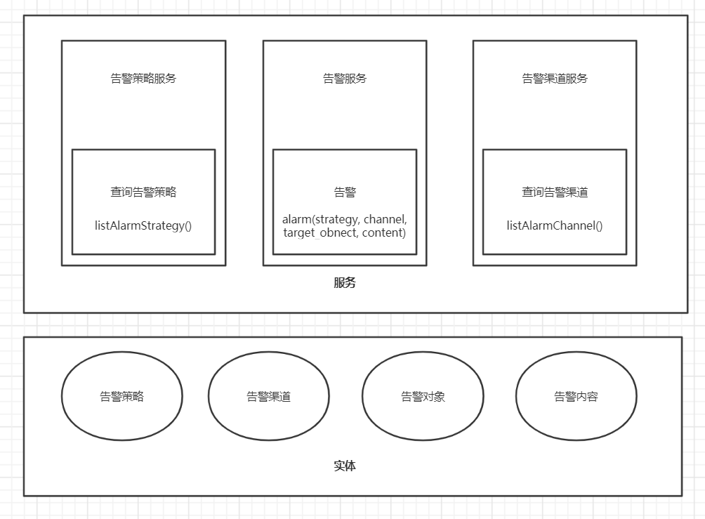

= 告警
:encoding: utf-8

== 情景分析

. 活动火爆，新年活动奖品库存低于10%，活动运营通知群发出告警消息

. 活动火爆，五一活动活动奖品库存为0，微信活动运营通知群发出告警消息，@道富 @元雄。未响应，五分钟后再次发出通知，直到其中一人响应，停止告警。

. bgc服务出现oom，钉钉商服后端群发出告警消息，@子昂，发出钉@子昂。未响应，五分钟后，@所有人

. bgc服务出现慢查询，http接口响应时间超过200ms，但不超过5000ms，每天下午5点告警到商服后端群。

. bgc服务出现慢查询，http接口响应时间超过5000s，告警到商服后端群。

. 数仓活跃消息延迟，钉钉商服-数据沟通群@祖鹏 @犀利哥，十分钟内相同问题不再告警。

== 模型设计

实体::

- 告警策略、告警内容、告警渠道、告警对象。

服务::

- 告警策略服务：查询告警策略

- 告警渠道服务：查询告警渠道

- 告警服务：告警

告警策略::

. 立刻发出告警

. 立刻发出告警，一段时间内未响应，再次发出告警，直到告警对象响应，停止告警。

. 立刻发出告警，一段时间内未响应，告警给其他告警对象，停止告警。

. 定时告警，到达某一时刻，将一段时间内的告警内容整合为一次告警，并发出。

. 立刻发出告警，一段时间内，相同的告警不再触发。

告警渠道

. 钉钉群

. 钉钉私聊

. 钉钉钉

. 企业微信群

. 企业微信私聊

. 邮件

. 短信

. 电话

告警策略服务、告警渠道服务，分别提供系统已支持的策略、渠道列表。告警服务提供告警功能，提供多个缺省参数的重载方法。