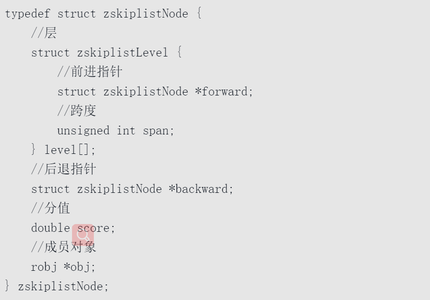

= 数据结构
:toc: left
:toclevels: 5
:toc-title: 目录

== 跳跃表

.跳跃表节点的结构

**跳跃表中的节点是有序的**

.跳跃表中添加元素
image::resource/Skip_list_add_element-en.gif[跳跃表中添加元素]

从图上看，跳跃表有点像一个缺省一些元素的二位数组，通过这些缺省的元素实现了 跳跃 ，加快查找速度

本质是已空间换时间，通过调整level的最大值，可以动态调节空间 复杂度和时间复杂度

跳跃表的查找

从head的最高层级开始

1 遍历next指向的节点，直到该节点的value大于等于目标value，或是遍历到空（即end）

2 如果该节点的value等于目标节点的value，则表示找到目标节点

3 如果该节点的value大于目标节点，或是遍历到空，表示当前层级的节点中没有目标节点

4 返回前一个节点，并使level - 1

5 重复1-4，直到找到目标节点，或是遍历到level = 1层的end。