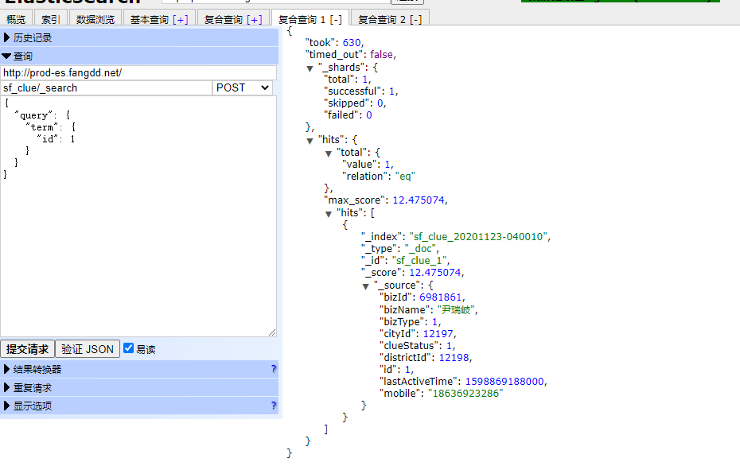
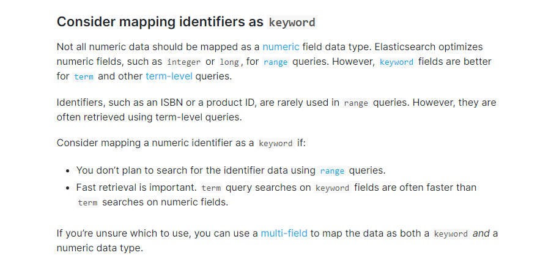
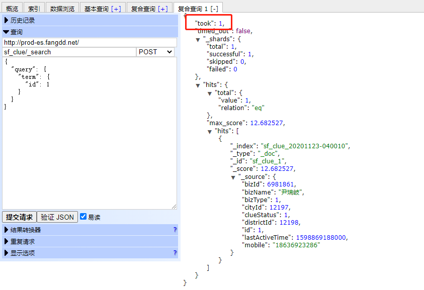
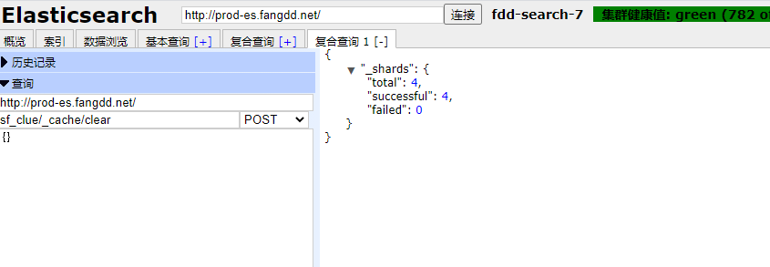
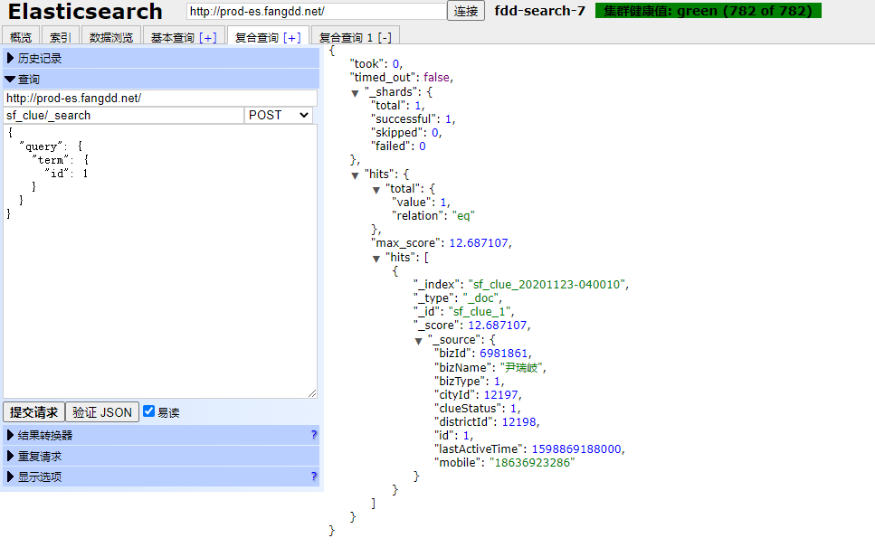
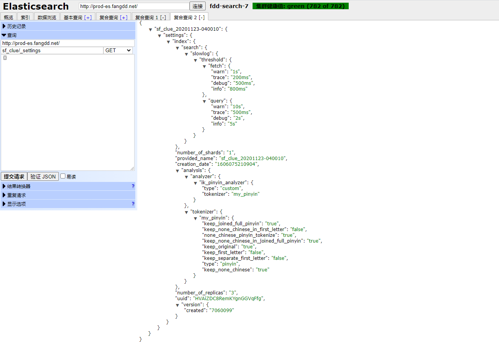
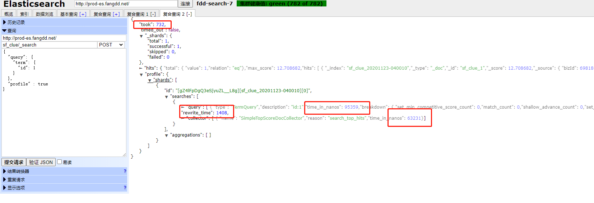
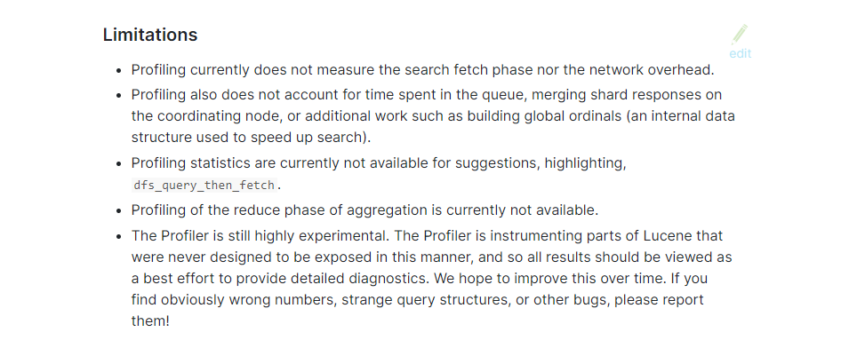
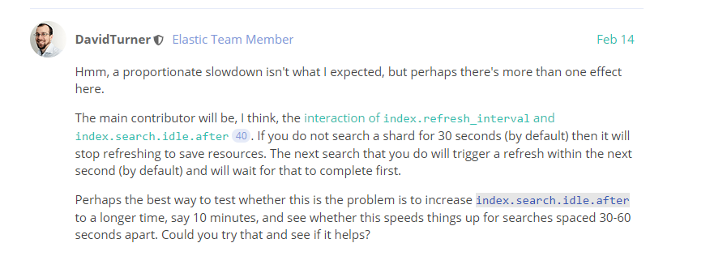
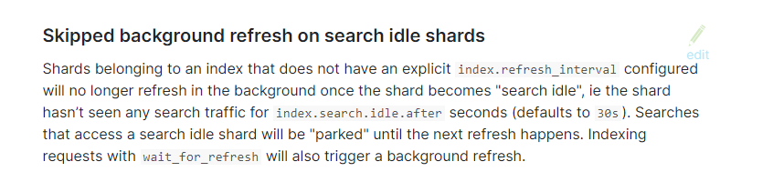

= elasticsearch

- inverted index-倒排索引

An inverted index lists every unique word that appears in any document and identifies all of the documents each word occurs in

text fields are stored in inverted indices, and numeric and geo fields are stored in **BKD trees**

- dynamic mapping

Elasticsearch automatically detects and adds new fields to the index. This default behavior makes it easy to index and explore your data—​just start indexing documents and Elasticsearch will detect and map booleans, floating point and integer values, dates, and strings to the appropriate Elasticsearch data types. 

You can define rules to control dynamic mapping and explicitly define mappings to take full control of how fields are stored and indexed.

- Profile APIedit-分析查询耗时情况

Provides detailed timing information about the execution of individual components in a search request.

Limitationsedit
Profiling currently does not measure the search fetch phase nor the network overhead.
Profiling also does not account for time spent in the queue, merging shard responses on the coordinating node, or additional work such as building global ordinals (an internal data structure used to speed up search).
Profiling statistics are currently not available for suggestions, highlighting, dfs_query_then_fetch.
Profiling of the reduce phase of aggregation is currently not available.
The Profiler is still highly experimental. The Profiler is instrumenting parts of Lucene that were never designed to be exposed in this manner, and so all results should be viewed as a best effort to provide detailed diagnostics. We hope to improve this over time. If you find obviously wrong numbers, strange query structures, or other bugs, please report them!

https://www.elastic.co/guide/en/elasticsearch/reference/7.x/documents-indices.html

rest url::

- POST index_name/_cache/clear //清缓存

- GET/POST index_name/_search //搜索

- GET index_name/_settings //查看索引配置

- PUT index_name/settings //设置索引配置

- POST index_name/_search //搜索返回耗时概要信息

    {“profile” : true}
    
== index settings

=== static settings

index.number_of_shards::
- Primary shard number,Defaunt is 1.

index.codec::
- comparesses strategy,default is LZ4(a higher compression ratio, at the expense of slower stored fields performance).

=== dynamic settings

== es慢查询问题排查

:tune-for-search-speed: https://www.elastic.co/guide/en/elasticsearch/reference/7.9/tune-for-search-speed.html

背景：最近在进行慢接口优化，有部分es查询时长超过500ms甚至1s。

先看了下几个查询，都是很简单的单字段或少数字段term查询，不是复杂查询引起的性能问题，索引数据量也不大，先找了其中一个索引sf_clue跟进问题。

测试发现，构造一个简单的单字段term查询，也会耗时超过600ms。

开始想办法优化，es官方给出了很多优化查询的方法（ {tune-for-search-speed}[tune-for-search-speed] ）

其中一条：可以考虑将id字段映射为keyword，在es中数值类型是针对范围查询优化的，在使用term查询时，keyword会更好。

于是，把sf_clue索引的id字段改为keyword，重建索引，再次查询效果不明显。

另一条优化建议：要为es提供充足的内存做缓存

结合之前测试发现的一个细节，当短时间内频繁请求sf_clue索引数据的时候，是可以快速返回的，间隔一段时间之后，就会出现特别慢的情况。猜测可能是缓存的影响。

于是开始测试，先频繁访问sf_clue，此时数据可以快速返回

之后清除sf_clue的缓存

再次访问sf_clue

依然可以快速返回结果，那也不是缓存的影响

继续定位问题，由于对es不熟悉，进展也比较慢，通过文档发现es有slow log 和profile api两个查询分析的功能

先查看了索引配置参数，确实开启了slow log

申请权限去生产查slow log，却没找到sf_clue相关log，那可能是log打印的时间限定比较就久，于是把log打印的时间改为200ms，没有日志，改为200ms依然没有日志。最后改为0，发现请求时间基本都是几百微秒，和请求返回took的几百毫秒相比明显少了很多。但根据slow log也无法获得更多信息了。

通过profile分析，发现查询的总耗时也是在几百微秒到几毫秒之间，而总的took确实几百毫秒（下图除了took单位为毫秒，其余耗时单位都是纳秒）

profile是有限制的，数据中没有包括网络耗时，队列等待等一些时间消耗

那查询慢的问题应该就定位在这些地方了

继续找问题，发现一个老哥的问题和我们现在的情况很像,官方的解答给出了新的线索

https://discuss.elastic.co/t/slow-first-request-on-an-index-after-a-short-amount-of-time/219292[slow-first-request-on-an-index-after-a-short-amount-of-time]

index.search.idle.after这个参数，默认值是30s，索引如果没有显示配置refresh_interval且在30s内没有被搜索，就会进入搜索空闲状态，如果对搜索空闲状态的索引发起搜索请求，这次搜索请求将在下一次refresh之后执行。而es的refresh间隔默认是1s，也就是说，搜索请求会在1s左右之后执行。搜索空闲，这是es7的一个新特性，目的是为了减少refresh，节省服务端资源

验证方法就很明确了，一个是加大index.search.idle.after的值，减少进入搜索空闲状态的情况发生，一个是显示配置refresh_interval，避免进入搜索空闲状态。

测试后发现确实是这个问题，由于商服人员不多，一些只提供给商服端查询的索引应该都存在着这种查询速度不稳定的情况，1s左右的延迟其实对用户还是有很大影响的，那些重要但搜索和插入不是很频繁的索引其实可以考虑显示配置refresh_interval

