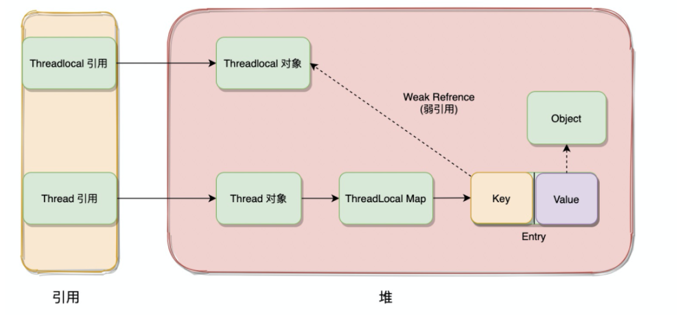

= 并发编程
:toc: left
:toclevels: 5
:toc-title: 目录

== Java中的线程状态

- new：还没有start的线程
- runnable：可运行的线程，可能正在执行，但也可能正在等待操作系统的其他资源，如处理器。
- blocked：在等待监视器锁（monitor lock）的线程，等待进入同步块
- waiting：等待状态的线程，通过调用Object.wait,Thread.join,LockSupport.park进入等待状态，等待其他线程执行特定的动作
- timed_waiting：指定等待时间的等待状态线程，通过调用Thread.sleep,Object.wait,Thread.join,LockSupport.parkNanos,LockSupport.parkUntil进入
- terminated：终止状态的线程，线程运行结束或者异常退出

[source, java]
.Thread.java中声明的线程状态
----
//十六进制
private final static int JVMTI_THREAD_STATE_ALIVE = 0x0001;
private final static int JVMTI_THREAD_STATE_TERMINATED = 0x0002;
private final static int JVMTI_THREAD_STATE_RUNNABLE = 0x0004;
private final static int JVMTI_THREAD_STATE_BLOCKED_ON_MONITOR_ENTER = 0x0400;
private final static int JVMTI_THREAD_STATE_WAITING_INDEFINITELY = 0x0010;
private final static int JVMTI_THREAD_STATE_WAITING_WITH_TIMEOUT = 0x0020;

----

**线程状态转换**

.线程状态转换图

. 新建线程，线程在new状态
. 调用start()进入runnable状态，runnable中有ready和running两个状态，runnable表示在队列中等待cpu，runnable表示cpu正在执行，对running状态的线程调用Thread.yield可以从running转到ready
. 对runnable状态的线程调用Thread.sleep(time),o.wait(time),t.join(time),LockSupport.parkNanos(),LockSupport.ParkUnitil()可以进入timed waiting状态，进行时间段的等待
. 对runnable状态的线程调用o.wait(),t.join(),LockSupport.park()可以进入waiting状态，通过o.notify(),o.notifyAll(),LockSupport.unpark()可以从waiting转到runnable
. runnable状态的线程会因为等待synchronized而进入blocked状态，待获取到锁之后会回到runnable
. runnable中的线程在执行完成任务后或者发生异常会进入到terminated(结束)状态

== synchronized

**synchronized的使用**

- 用在代码块上，锁定一个对象

- 用在方法签名上，等价于用在代码块上并且锁定this

- 用在静态方法签名上，等价与用在代码块上并且锁定T.class

[source, java]
.synchronized的使用
----
class MyClass {
    Object o = new Object();
    void f1() {
        synchronized (o) {
            System.out.println("用在代码块上");
        }
    }

    synchronized void f2() {
        System.out.println("用在方法上,锁this对象");
    }

    synchronized static void f3() {
        System.out.println("用在静态方法上，锁MyClass.class对象");
    }
}
----

synchronized可重入：一个线程已经拥有某个对象的锁，再次申请的时候仍然会得到该对象的锁（在一个对象的同步方法中调用另一个同步方法）

synchronized(Object) 一般不用在String Integer等对象上

**synchronized的实现**

synchronized锁是java提供的原子性内置锁，也被称为监视器锁，使用之后会在同步的代码块前后加上monitorenter和monitorexit字节码指令，monitorenter指令会尝试获取对象的锁，如果对象没有锁或者已经获得锁了，锁的计数器+1，monitorexit则会把计数器-1，当为0时则释放锁，底层都是依靠依靠操作系统的互斥锁实现的。由于依赖的了底层，操作系统在阻塞和唤醒线程时都会从用户态切换到内核态，这种转换会非常消耗性能。 所以在1.6之前，synchronized的性能很低，1.6之后不断对synchronized进行优化，目前已经发展成出偏向锁，轻量级锁和重量级锁。加锁的顺序也是从偏向锁到轻量级锁再到重量级锁，一开始使用偏向锁时利用cas将要被锁的对象头MarkWrod部分设置为线程id，后续如果有其他线程竞争该锁，则升级为轻量级锁，轻量级锁主要利用cas修改对象头锁记录和自旋来实现。而重量级锁就是前面提到的利用监视器锁和操作系统互斥锁。

- 偏向锁：用一个markword记录线程id
- 自旋锁：如果有线程争用，升级为自旋锁，未获得锁的线程利用cas不断去修改markword
- 重量级锁：如果自旋10次后，升级为重量级锁（去操作系统申请）
- 偏向锁、自旋锁是用户态，不用切换到内核态，但是自旋占用cpu
- 重量级锁是内核态，切换内核态有开销，但是没有自旋
- 执行时间短，线程数少用自旋。执行时间长，线程多，用系统锁

**ReentrantLock和synchronized比较**
|===
| |ReentrantLock |synchronized

|实现
|jdk实现，AQS
|jvm实现，监视器

|灵活性
|支持响应中断、超时、尝试获取锁
|×

|释放锁
|必须显示调用unlock
|自动释放

|公平锁
|支持
|不支持

|条件队列
|支持多个队列
|1个队列

|重入
|可重入
|可重入
|===

== volatile

*作用*：1保证变量在线程间的可见性 2禁止指令重排

*如何保证线程间的可见性*：1volatile变量修改后会刷新主存 2会导致其他线程工作内存中的变量失效，需要重新从主存读

*如何禁止指令重排*：JVM的实现会在volatile读写前后均加上内存屏障

LoadLoadBarrier
volatile 读操作
LoadStoreBarrier

StoreStoreBarrier
volatile 写操作
StoreLoadBarrier

*双重检查锁单例为什么需要volatile*
new 分为3步 1申请内存，2初始化赋值，3将指针指向对象
由于指令重排，可能会先赋值指针，后初始化赋值
在赋值指针后，初始化完成之前，其他线程会拿到未初始化完成的对象使用，线程不安全

**相关的Java内存模型知识**

从Java内存模型上看，实际分为了main memory和work memory，main memory包括了静态字段、实例字段、数组对象等，而work memory包括了局部变量和方法参数，是**线程私有**的。

image::resource/java_thread_memory_model.jpg[]

内存间的交互操作：
lock
unlock
read
load
use
assign
store
write

JMM层面的“内存屏障”：

LoadLoad屏障： 对于这样的语句Load1; LoadLoad; Load2，在Load2及后续读取操作要读取的数据被访问前，保证Load1要读取的数据被读取完毕。
StoreStore屏障：对于这样的语句Store1; StoreStore; Store2，在Store2及后续写入操作执行前，保证Store1的写入操作对其它处理器可见。
LoadStore屏障：对于这样的语句Load1; LoadStore; Store2，在Store2及后续写入操作被刷出前，保证Load1要读取的数据被读取完毕。
StoreLoad屏障： 对于这样的语句Store1; StoreLoad; Load2，在Load2及后续所有读取操作执行前，保证Store1的写入对所有处理器可见。

== cas

cas(data,expected,newValue)

CompareAndSwap比较并交换

cas参数：需要3个参数，data数据对象内存地址，expected期望在data的值为expected的时候为data赋值，newValue新值

cpu支持保证原子性
[source,java]
----
cas(data, expected, newValue) {
    if (data.value == expected) {
        data.value = newValue;
    } else {
        //data.value的值不变。一般通过死循环重新读取expected，执行cas
    }
}
----

**cas的ABA问题** ：比如a=1,线程1读到a=1，线程2赋值a=2，线程3赋值a=1，此时线程1赋值，a=1，但是a已经经过了2次修改。可以不管，或者使用版本号控制。

== JUC中常见的并发工具类

ReentrantLock ReadWriteLock CountDownLatch CyclicBarrier Semaphore Exchanger 各种blockingQueue

VarHandle（jdk9） 一个变量的包装类，普通类型字段也可以原子操作，比反射快，native方法实现

**练习题**

. 实现一个容器，提供add  size方法，写两个线程，线程1添加10个元素到容器中，线程2实现监控元素的个数，当个数到5个时，线程2给出提示并结束
. 写 一个固定容量同步容器，拥有put和get方法，以及getCount方法，能够支持两个生产者线程以及10个消费者线程的阻塞调用
. 两个线程，一个打印字符，一个打印数字，打印a1b2c3...z26

== AQS
核心是state和一个双向链表，链表中是线程，用cas入队出队

**state**
[source, java]
----
//具体定义由子类决定。例如实现一个互斥锁，可以定义state=1为锁已被获取，0为锁未获取锁。尝试获取锁时，调用cas（state, 0, 1)，成功则获取锁成功，失败则进入同步队列
private volatile int state;
----

**链表节点数据结构**
[source,java]
----
static final class Node {
        static final Node SHARED = new Node();
        static final Node EXCLUSIVE = null;
        //由于超时或中断，该节点被取消。节点永远不会离开这个状态
        static final int CANCELLED =  1;
        //这个节点的后继节点被阻塞，当前节点在释放或取消时必须唤醒后继节点
        //后继结点入队时，会将前继结点的状态更新为SIGNAL
        static final int SIGNAL    = -1;
        //表示结点等待在Condition上，当其他线程调用了Condition的signal()方法后，CONDITION状态的结点将从等待队列转移到同步队列中，等待获取同步锁。
        static final int CONDITION = -2;
        //共享模式下，前继结点不仅会唤醒其后继结点，同时也可能会唤醒后继的后继结点。releaseShared应该传播到其他节点。这是在doreleasshared中设置的(仅针对头部节点)，以确保传播继续
        static final int PROPAGATE = -3;

        //负值表示结点处于有效等待状态，而正值表示结点已被取消，0是新结点入队时的默认状态
        volatile int waitStatus;
        volatile Node prev;
        volatile Node next;
        volatile Thread thread;
        //用于condition
        Node nextWaiter;
    }
----

**如何利用cas在链表尾部添加节点？**
[source,java]
----
//死循环：先把prev指向tail，用cas把tail设为当前节点，设置成功后把oldTail的next指向当前节点
//多个线程间的竞争资源只有tail这一个指针
private Node enq(Node node) {
    for (;;) {
        Node oldTail = tail;
        if (oldTail != null) {
            node.setPrevRelaxed(oldTail);
            if (compareAndSetTail(oldTail, node)) {
                oldTail.next = node;
                return oldTail;
            }
        } else {
            initializeSyncQueue();
        }
    }
}
----

**如何唤醒下一个节点？**

通过enq方法可以发现，在将tail指针后移之后，其他线程就可以拿到这个新的tail节点，往后链接，但此时oldTail的next可能还并未指向tail，就会导致链表的尾部几个节点可能暂时是一个单项链表。此时，如果oldTail是头节点，通过头节点的next指针无法找到next，但实际后面还有节点。

[source, java]
----
private void unparkSuccessor(Node node) {
    Node s = node.next;
    //如果next=null或者已被取消，就从tail往前遍历，找到最靠前的等待状态的节点
    if (s == null || s.waitStatus > 0) {
        s = null;
        for (Node p = tail; p != node && p != null; p = p.prev)
            if (p.waitStatus <= 0)
                s = p;
    }
    if (s != null)
        LockSupport.unpark(s.thread);
}
----

**取消队列中的节点**

[source,java]
----
private void cancelAcquire(Node node) {
    Node pred = node.prev;
    while (pred.waitStatus > 0)
        node.prev = pred = pred.prev;
    Node predNext = pred.next;
    node.waitStatus = Node.CANCELLED;

    // If we are the tail, remove ourselves.
    if (node == tail && compareAndSetTail(node, pred)) {
        pred.compareAndSetNext(predNext, null);
    } else {
        // If successor needs signal, try to set pred's next-link
        // so it will get one. Otherwise wake it up to propagate.
        int ws;
        if (pred != head &&
            ((ws = pred.waitStatus) == Node.SIGNAL ||
             (ws <= 0 && pred.compareAndSetWaitStatus(ws, Node.SIGNAL))) &&
            pred.thread != null) {
            Node next = node.next;
            if (next != null && next.waitStatus <= 0)
                pred.compareAndSetNext(predNext, next);
        } else {
            unparkSuccessor(node);
        }

        node.next = node; // help GC
    }
}
----

**如何实现带超时时间的等待**
[source, java]
----
//1 设置计时器
//2 将节点添加到同步队列
//3 死循环
//3.1 如果前驱是head，尝试获取锁
//3.2 如果超时结束
//3.3 如果前驱状态是SIGNAL，表示前驱节点也在等待，就进入超时等待状态
private boolean doAcquireNanos(int arg, long nanosTimeout)
        throws InterruptedException {
    final long deadline = System.nanoTime() + nanosTimeout;
    final Node node = addWaiter(Node.EXCLUSIVE);
    try {
        for (;;) {
            final Node p = node.predecessor();
            if (p == head && tryAcquire(arg)) {
                setHead(node);
                p.next = null; // help GC
                return true;
            }
            nanosTimeout = deadline - System.nanoTime();
            if (nanosTimeout <= 0L) {
                cancelAcquire(node);
                return false;
            }
            //shouldParkAfterFailedAcquire逻辑
            //如果前驱是已取消的节点，找到第一个未取消的节点
            //如果前驱是未取消的节点，如果状态是SIGNAL，返回true，否则用cas设前驱节点为SIGNAL
            if (shouldParkAfterFailedAcquire(p, node) &&
                nanosTimeout > SPIN_FOR_TIMEOUT_THRESHOLD)
                LockSupport.parkNanos(this, nanosTimeout);
            if (Thread.interrupted())
                throw new InterruptedException();
        }
    } catch (Throwable t) {
        cancelAcquire(node);
        throw t;
    }
}
----

**需要子类实现的方法**

[source, java]
----
protected boolean tryAcquire(int arg)
protected boolean tryRelease(int arg)
protected int tryAcquireShared(int arg)
protected boolean tryReleaseShared(int arg)
protected boolean isHeldExclusively()
----

**尝试获取锁**
[source, java]
----
//tryAcquire尝试获取锁
//addWaiter把节点添加到链表
//acquireQueued调用shouldParkAfterFailedAcquire判断，之后阻塞线程
public final void acquire(int arg) {
    if (!tryAcquire(arg) &&
        acquireQueued(addWaiter(Node.EXCLUSIVE), arg))
        selfInterrupt();
}
----

**释放**
[source,java]
----
public final boolean release(int arg) {
    if (tryRelease(arg)) {
        Node h = head;
        if (h != null && h.waitStatus != 0)
            unparkSuccessor(h);
        return true;
    }
    return false;
}
----

**等待队列和同步队列**
AQS里的链表是统合部队列，里面放的是因为竞争同步资源而阻塞的线程，前驱执行完就可以执行

condition里面的链表是等待队列，里面放的是等待在这个条件上的线程，需要被信号唤醒才能继续执行

**ReentrantLock怎么实现绑定多个等待队列**
通过condition，每个condition都是一个链表(等待队列)，里面存放等待的线程。当线程被唤醒时候把它放到AQS同步队列去

== ThreadLocal

每个Thread对象中有一个ThreadLocalMap，同时Thread中还可以声明多个ThreadLocal。

这些ThreadLocal对象的弱引用作为key关联在ThreadLocalMap中。

ThreadLocal内部是使用ThreadLocalMap来存储的，但是该ThreadLocalMap并不是threadLocal对象自己的，而是使用的当前线程的map，即该threadlocalmap是当前线程的thread对象的变量。同个线程下不同的threadlocal，是存放在同一个thread的threadlocalmap中的。 在使用ThreadLocal进行存储时，是直接将ThreadLocal对象作为key值进行存储，value就存着具体的变量值。这样每个thread都有自己私有的map来将threadLocal作为唯一key值，即同个threadlocal，他将自己作为key存在各个thread的map中，将具体值作为value来实现同个变量不同线程之间是不同的。

同时，thread中的ThreadLocalMap的key值，使用的是弱引用，弱引用的特点是，堆内存使用完后回收。因为threadlocalmap是thread的变量，而threadlocal的设计者认为因为有线程池的存在，thread的存活时间一般都比较长，这就可能导致已经没用的local对象会一直存放在thread的map中。所以将该key值设置为弱引用，这样在threadlocal所在的作用域结束了工作，该map中的key就只剩下弱应用，就可以在垃圾回收的时候被回收掉。

但是value是强引用，如果使用完成之后不进行remove，value仍然可能存在内存泄露问题。

不过目前大部分都将threadlocal声明为final static，全局存在，所以实际上该弱引用可能不会起作用。

threadlocalmap解决哈希冲突的方法与hashmap的不同，hashmap是使用链表+红黑树(大于8时转换)解决的，而threadlocalmap没有链表，使用开放地址法，当哈希冲突时，就取下一个位置，如果下一个位置也不为空，则继续往后取。如果set到达阈值（数组长度的2 / 3），则要进行resize，大小为原来的两倍，并且会重新计算位置，冲突的解决方法同样是开放地址法。

== 引用类型

- 强引用
- 弱引用：堆内存使用完后回收，做缓存，ThreadLocal，用作没有其他强引用指向对象时候回收对象（weakHashMap）
- 软引用：下一次GC时候回收
- 虚引用：有一个队列，当虚引用被回收时候会有一个通知发出，用于堆外内存，GC不能回收堆外内存，所以当指向堆外内存的引用被回收时候需要收到通知，进行回收（新版jdk可以直接操作内存，用虚引用进行回收）

== 线程池

**ThreadPoolExecutor继承关系**: ThreadPoolExecutor > AbstractExecutorService > ExecutorService > Executor

**原理概述**

其实线程池总的执行原理，就是每个创建出来的线程，不断的从阻塞队列获取任务进行执行，没有任务时线程在阻塞队列上获取时阻塞，根据当前最大线程数和核心线程数数量关系以及等待时间，选择设置阻塞等待时间，在被唤醒之后还没有任务执行，则选择是否释放多余的空闲线程。

任务的添加执行流程，就是根据当前线程数，如果当前线程数小于核心线程数，直接创建线程执行，如果大于则优先入队，入队失败再判断是否大于最大线程数，如果不大于则创建线程执行，如果大于则执行拒绝策略

**实现上的一些细节**

- ThreadPoolExecutor中的任务都委托给worker执行了，worker利用thread factory创建了一个线程，不断从队列取任务执行。当队列空时，核心线程阻塞，扩展的线程超时阻塞，到到超时时间后结束。

- ThreadPoolExecutor利用BlockingQueue和Worker实现了Executor.execute。但它并没用重写ExecutorService.submit、ExecutorService.invokerAll、ExecutorService.invokerAny。这三类方法是在AbstractExecutorService中实现的。

- AbstractExecutorService通过委托给 *FutureTask* 实现submit和invoke方法。FutureTask是Future的实现

- FutureTask的主要执行逻辑：

. 通过callable构造，此时state=NEW，表示还未执行完成的新任务
. 调用run方法，由调用run方法的线程执行任务，run返回后将state变为COMPLETING，设置outcome，再将状态变为NORMAL，并唤醒所有waiters
. 如果其他线程尝试调用get方法，1 当state=NEW或COMPLETING时，构造WaitNode，把这个线程放入等待队列并阻塞。 2 当state=NORMAL时直接返回。3如果需要设置超时时间，在park的时候设置。

- Executor接口：只定义了支持Runnable的execute方法

- ExecutorService接口：扩展Executor，额外定义了shutdown方法，和支持Callable的submit、invokerAll、invokerAny方法。可以理解为一个FutureTask的包装类。但是任然没有实现execute方法。并且submit、invoke方法里面依赖了execute方法

- AbstractExecutorService：ExecutorService的默认实现，利用FutureTask来实现submit、invokeAll等方法

- ThreadPoolExecutor利用BlockingQueue和Worker实现了execute

*ThreadPoolExecutor7个参数*

- 核心线程数
- 最大线程数
- 线程保持活跃时间
- 线程保持活跃时间单位
- 阻塞队列
- 线程创建工厂
- 线程丢弃策略

**线程池有哪些拒绝策略？**

- AbortPolicy：直接丢弃任务，抛出异常，这是默认策略
- CallerRunsPolicy：只用调用者所在的线程来处理任务
- DiscardOldestPolicy：丢弃等待队列中最旧的任务，并执行当前任务
- DiscardPolicy：直接丢弃任务，也不抛出异常

**通常会自定义拒绝策略，把未能处理的任务记到mq或者数据库，后续处理，也可以告警**

*为什么有单线程的线程池*：有任务队列，可以帮忙管理生命周期

*为什么一般不用CachedThreadPool*：因为它的maxsize设置的是Integer.MAX_VALUE，太大了

*为什么一般不用FixedThreadPool*：FixedThreadPool用的LinkedBlockingQueue，最大长度为Integer.MAX_VALUE，可能会溢出

*在ThreadPoolExecutor执行一个runnable是应该用execute还是submit？有什么区别？*：ThreadPoolExecutor里，execute是直接委托给worker执行的，submit是先用FutureTask包装Runnable再委托给worker执行

**相关类**

.Callable
[source, java]
----
//有返回值的Runnable
public interface Callable<V> {
    V call();
}
----

.Future
[source, java]
----
//Future表示异步计算的结果。只有当计算完成时，才能使用get方法检索结果，否则get方法会阻塞
public interface Future<V> {
    boolean cancel(boolean mayInterruptIfRunning);
    boolean isCancelled();
    boolean isDone();
    V get();
    V get(long timeout, TimeUnit unit);
}
----

.FutureTask
[source, java]
----
//同时继承future和runnable。可取消的异步计算。提供了Future的基本实现。
public class FutureTask<V> implements RunnableFuture<V> {
//----------主要字段----------
    //任务
    private Callable<V> callable;
    //返回值
    private Object outcome;
    //执行任务的线程
    private volatile Thread runner;
    //等待队列，里面是等待在Future上的线程，实现是单向链表
    private volatile WaitNode waiters;
    //状态，通过状态判断任务是否执行完
    private volatile int state;

//----------主要方法----------
    //通过callable构造
    public FutureTask(Callable<V> callable) {}
    //取消，通过interrupt取消
    public boolean cancel(boolean mayInterruptIfRunning) {}
    //拿结果，通过状态判断是否执行完，执行完返回结果，否则添加到waiters阻塞，当执行完后唤醒
    public V get() {}
    //执行任务
    public void run() {}

    //等待队列的节点
    static final class WaitNode {
        volatile Thread thread;
        volatile WaitNode next;
        WaitNode() { thread = Thread.currentThread(); }
    }
----

.Executor
[source,java]
----
//执行器接口，可以执行一个任务。
//这个接口提供了一种将任务提交与每个任务如何运行的机制(包括线程使用、调度等细节)分离的方法
public interface Executor {
    void execute(Runnable command);
}
----

.ExecutorService
[source, java]
----
//扩展的Executor，提供shutdown等执行器的管理方法，并额外支持了有返回值的任务
public interface ExecutorService extends Executor {
    //shutdown
    void shutdown();
    List<Runnable> shutdownNow();
    boolean isShutdown();
    boolean isTerminated();
    boolean awaitTermination(long timeout, TimeUnit unit);
    //扩展execute方法，支持返回值
    <T> Future<T> submit(Callable<T> task);
    <T> Future<T> submit(Runnable task, T result);
    Future<?> submit(Runnable task);
    //批量执行任务，支持返回值
    <T> List<Future<T>> invokeAll(Collection<? extends Callable<T>> tasks);
    //批量执行任务，支持返回值，支持过期时间
    <T> List<Future<T>> invokeAll(Collection<? extends Callable<T>> tasks,
                                  long timeout, TimeUnit unit);
    <T> T invokeAny(Collection<? extends Callable<T>> tasks);
    <T> T invokeAny(Collection<? extends Callable<T>> tasks,
                    long timeout, TimeUnit unit);
}
----

.AbstractExecutorService
[source, java]
----
//ExecutorService的默认实现，利用FutureTask来实现submit、invokeAll等方法
//可以理解为一个FutureTask的包装类
public abstract class AbstractExecutorService implements ExecutorService {
    protected <T> RunnableFuture<T> newTaskFor(Callable<T> callable) {
        return new FutureTask<T>(callable);
    }
    public <T> Future<T> submit(Callable<T> task) {
        if (task == null) throw new NullPointerException();
        RunnableFuture<T> ftask = newTaskFor(task);
        execute(ftask);
        return ftask;
    }
}
----

.ThreadPoolExecutor
[source, java]
----
//上面说AbstractExecutorService利用FutureTask来实现submit、invokeAll、invokerAny方法，这些方法中最终都调用了Executor.execute这个抽象方法，ThreadPoolExecutor使用Worker和BlockingQueue实现了execute
public class ThreadPoolExecutor extends AbstractExecutorService {
    //任务队列，线程池七大参数之一
    private final BlockingQueue<Runnable> workQueue;
    //一些对于线程池或线程池内字段的操作需要加锁，用这把锁
    private final ReentrantLock mainLock = new ReentrantLock();
    //工作线程集合，包含了线程池中的所有线程，主要用于线程池停止时候中断所有线程、查看当前线程池的线程数。只有在持有mainLock的时候才可以访问
    private final HashSet<Worker> workers = new HashSet<>();
    //用于创建线程的工厂，线程池七大参数之一
    private volatile ThreadFactory threadFactory;
    //拒绝策略，线程池七大参数之一
    private volatile RejectedExecutionHandler handler;
    //线程等待超时时间，线程池七大参数之一
    private volatile long keepAliveTime;
    //核心线程size，线程池七大参数之一
    private volatile int corePoolSize;
    //最大线程size，线程池七大参数之一
    private volatile int maximumPoolSize;

    private final class Worker
        extends AbstractQueuedSynchronizer
        implements Runnable
    {
        //必须通过一个任务创建worker，这个任务通常是线程池队列满时无法加入队列的任务，或者是创建核心线程时候的任务
        //通过ThreadFactory创建一个执行的线程，但这个线程执行的并不是线程池等待队列的任务。可以发现worker实现了runnable接口，worker自身也是一个任务，这里创建的线程执行的就是worker自身的run方法。
        Worker(Runnable firstTask) {
            this.firstTask = firstTask;
            this.thread = getThreadFactory().newThread(this);
        }
        //worker的主要逻辑，firstTask不为空就执行firstTask，然后把他制空
        //之后死循环去线程池队列拿任务执行
        //拿任务时候如果队列空，如果是核心线程就阻塞，否则就超时阻塞
        //如果到了超时阻塞时间阈值，从队列拿到null，线程就运行结束，安全退出。
        public void run() {
            if (firstTask != null) {
                firstTask.run();
            }
            while(true) {
                Runnable task = isCoreThread ? workQueue.take() : workQueue.poll(keepAliveTime, TimeUnit.NANOSECONDS);
                if (task == null)
                    break;
                task.run();
            }
        }
    }

    //拒绝任务，委托给handler处理
    final void reject(Runnable command) {
        handler.rejectedExecution(command, this);
    }
    //用runnable创建一个worker，线程池中所有的任务都委托给worker执行
    private boolean addWorker(Runnable firstTask, boolean core) {
        new Worker(firstTask).start();
        return true;
    }
    //如果worker数小于核心线程数，直接创建核心线程
    //否则把任务添加到阻塞队列
    //如果队列满了，尝试添加worker，如果已经达到最大线程数，添加失败执行拒绝策略
    public void execute(Runnable command) {
        if (workers.size() < corePoolSize) {
            addWorker(command, true);
        } else if (workQueue.offer(command)) {

        } else if (!addWorker(command, false)) {
            reject(command);
        }
    }
}
----

CompletableFuture 可以用来实现异步并发调多个接口

== ConcurrentHashmap
这是同步的HashMap实现，而且分为1.7和1.8版本，1.8实现主要是使用CAS+synchronized和volatile关键字来实现的，相比1.7中的实现，他的粒度更小，只会在哈希冲突的位置上锁住那条链或者那颗树，并不会锁住其他不相关的位置。如果不会产生hash冲突，即数组元素位置为null，则尝试使用cas设置该值，成功即返回，失败就锁住进行插入操作。

由于相比1.7，他的所有关键的变量都加上volatile关键字，保证所有线程更改对其他线程立即可见，所在get的时候就不需要上锁，直接计算获取即可。

存储上，相比1.7，1.7主要利用段结构，1.8使用了同HashMap一样的存储，并且比1.7多了红黑树。