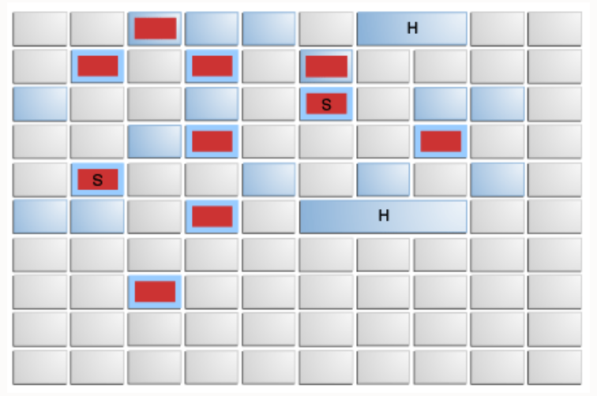

= G1

= 定义

G1 is a generational, incremental, parallel, mostly concurrent, stop-the-world, and evacuating garbage collector which monitors pause-time goals in each of the stop-the-world pauses.

= 堆布局&内部数据结构

== 堆布局

=== 传统堆布局
image::jsgct_dt_006_prm_gn_sz_new.png[jsgct_dt_006_prm_gn_sz_new]

=== G1堆布局

== G1额外的数据结构

== Remembered Set

思考一个场景：

在分代收集器中，进行一次young gc，如何做到不进行全堆扫描？

points-into

points-out

解决在GC时只收集部分region的问题

记录并维护指向当前region的引用

old-to-young references

old-to-old references

TIP: region中被划分为多个card。card将512个byte映射到1个byte，对region中的部分连续空间中的对象进行聚合，粒度变粗，提升在region中查找对象的效率。

== Remembered Set如何维护

每一次发生引用变动，都需要更新remembered set，G1中通过remembered set barrier来实现更新。

=== Remembered Set Barrier

post write barrier

以指针的写操作：x.f = y为例，G1论文中给出了Remembered Set Barrier的伪代码：

1| rTmp := rX XOR rY

2| rTmp := rTmp >> LogOfHeapRegionSize

3| // Below is a conditional move instr

4| rTmp := (rY == NULL) then 0 else rTmp

5| if (rTmp == 0) goto filtered

6| call rs_enqueue(rX)

7| filtered:

1.2对x、y指向的地址进行异或运算，将结果右移HeapRegionSize位，如果x、y在同一个region，结果为0

4判断y是否为空，如果y为空，结果为0

5如果透过上面两次过滤，结果不为0，那说明创建了一个out-of-region pointer，这时我们应该在y对象所在region的RSet中记录上x对象所在的region、card，G1在这里进行了一些过滤优化和异步优化，即体现在rs_enqueue(rX)方法。

=== logging write barrier
为了尽量减少write barrier对mutator性能的影响，G1将一部分原本要在barrier里做的事情挪到别的线程上并发执行。 实现这种分离的方式就是通过logging形式的write barrier：mutator只在barrier里把要做的事情的信息记（log）到一个队列里，然后另外的线程从队列里取出信息批量完成剩余的动作。

==== rs_enqueue

读取x对象所在的card，如果是dirty，不执行任何操作（这里聚合了一个卡上的多次操作，在向空卡写入时，这种情况会频繁发生）。如果card is not dirty，将他标记为dirty，将这个card记录到当前线程的一个buffer中(remembered set log queue)。如果buffer满了（默认256），buffer会被放到一个global set 中，再给当前线程分配一个空队列。

=== remembered set thread

当global buffer set size到达阈值时（默认5），remembered set thread会处理buffer，把buffer当作队列，一个个的处理队列中的card。直到global buffer set size减小到阈值的1 / 4。

hot card: 被频繁修改的card。为了避免频繁处理hot card，用一个新的card table记录 从上一次evacuation pause起，这个card被标记为dirty的次数。remembered set thread每处理一个card，这个card的次数就会+1。当count达到hotness threshold（默认4）时，这个card会被加入到hot queue（默认大小1k），在evacuation pause开始时候，hot queue会被处理掉。如果queue满了，会从queue中取出第一个card处理掉。

如何处理dirty card？remembered set thread先将card置为clean，后续的修改都将重新把card置为dirty。之后找到所有发生变化的指针中指向当前region外的指针，将当前region、当前card记录到外部region的RSet中。

= 垃圾收集循环（garbage collection cycle）

从较高的层面看，G1在两个阶段中交替::

- young-only phase：只回收年轻代，这会导致堆中老年代region的比例变大。

- space-reclamation phase：除了回收年轻代，G1还会增量的回收老年代。

image::G1_garbage_collectio_cycle.png[]

young-only phase::

* 从几次Normal young collections开始。对象不断进入老年代，当老年代占比达到一定阈值（Initiating Heap Occupancy threshold）时，开始从young-only过渡到space-reclamation。这时，G1安排一次Concurrent Start young collection代替一次Normal young collection。

** Concurrent Start：在执行一次Normal young collection的基础上，额外启动标记过程。并发标记确定所有老年代中当前可达的对象，用于在space-reclamation phase保留这些对象。在并发标记过程中，可能同时发生Normal young collection。标记过程中有两次stw停顿：remark、cleanup。

*** remark：这次停顿中完成标记过程，执行全局引用处理和类卸载。回收空region、清理内部数据结构。在remark和cleanup之间，G1统计每个region的活对象数

*** cleanup：依据region的回收价值，对region进行排序。这次停顿根据决定是否将要进入space-reclamation phase，如果可以回收的region占比小于XX:G1HeapWastePercent，就不会进入space-reclamation phase。

TIP: G1中何时算作marking完成？1、并发标记遍历了所有的SATB中的对象。2、所有logging buffer都被处理完（包括线程本地的buffer和全局的buffer）。在与用户线程并发的情况下，用户线程会不断的向buffer中添加数据，因此达到条件2比较难，所以这里有一次STW。停止用户线程，清空buffer就很容易了，这次停顿就是remark。清空buffer的过程是并行的，防止某些buffer处理慢导致停顿时间长。

space-reclamation phase::

* 这个阶段由多个Mixed collection组成，Mixed collection同时疏散（evacuate）年轻代和老年代有对象存活的region。当G1认为疏散更多老年代region不能产生足够多的空闲空间时，space-reclamation phase结束。

space-reclamation phase结束后，收集循环将重新由一次young-only phase开始。
