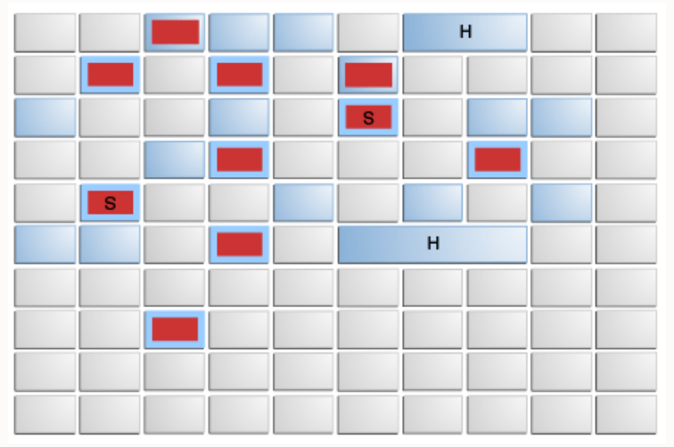
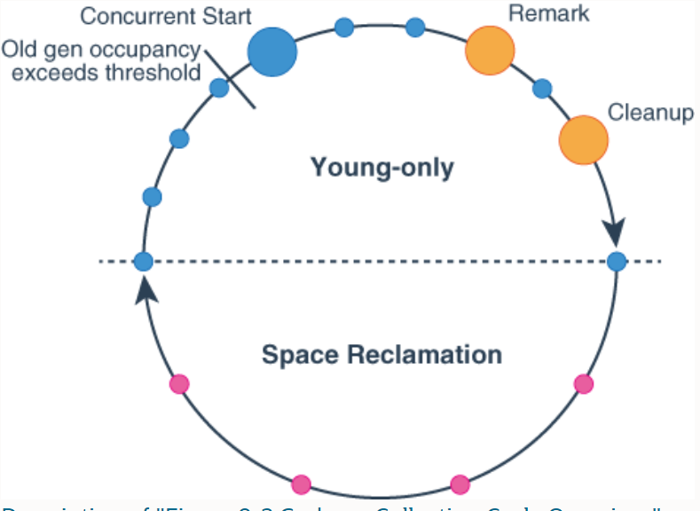

== G1

=== 基本概念

G1 is a generational, incremental, parallel, mostly concurrent, stop-the-world, and evacuating garbage collector which monitors pause-time goals in each of the stop-the-world pauses. 

=== 堆布局

当有内存请求时，G1的内存管理机制会先给一些空闲的region指定分代，然后将它们分发给app，app可以自己控制这些region内部空间的分配。

在其他收集器中，eden、servivor、old通常使用连续虚拟内存空间，在G1中，这些区域通常不采用连续的布局模式。

内存管理机制总是将年轻代的eden region分配给app，特例是大对象将直接分配到老年代。
 
G1垃圾收集暂停可以回收整个年轻代，并且可以额外回收部分老年代

=== 垃圾收集循环（garbage collection cycle）

从较高的层面看，G1在两个阶段中交替::

- young-only phase：只回收年轻代，这会导致堆中老年代region的比例变大。

- space-reclamation phase：除了回收年轻代，G1还会增量的回收老年代。

young-only phase::

* 这个阶段从几次Normal young collections开始（Pause Young (Normal) (G1 Evacuation Pause)）。对象不断进入老年代，当老年代占比达到一定阈值（Initiating Heap Occupancy threshold）时，开始从young-only过渡到space-reclamation。这时，G1安排一次Concurrent Start young collection代替一次Normal young collection。

** Concurrent Start：在执行一次Normal young collection的基础上，额外启动标记过程（marking process）。并发（concurrent marking）标记确定所有老年代中当前可达的对象，用于在space-reclamation phase保留它们。在并发标记过程中，可能同时发生Normal young collection。标记过程（marking processmarking process）中有两次stw停顿：remark、cleanup。

*** remark：这次停顿结束标记过程，执行全局引用处理和类卸载。回收空region、清理内部数据结构。在remark和cleanup之间，G1计算一些信息（以便于在之后能够并发的回收空闲的老年代区域），这个过程在cleanup停顿中结束。-XX:G1MixedGCLiveThresholdPercent=85 老年代region中，活对象的比率超过G1MixedGCLiveThresholdPercent时，space-reclamation phase将不会回收这个region

*** cleanup：这次停顿决定是否将要进入space-reclamation phase。会得到一个collection set candidates，如果小于-XX:G1HeapWastePercent=5，不会进入space-reclamation phase。如果将要进入space-reclamation phase，young-only phase将已一次Prepare Mixed young collection结束。

space-reclamation phase::

* 这个阶段由多个Mixed collection组成，Mixed collection同时疏散（evacuate）年轻代和老年代有对象存活的region。当collection set candidates小于-XX:G1HeapWastePercent=5，space-reclamation phase结束。

space-reclamation phase结束后，收集循环将重新由一次young-only phase开始。

=== G1内部细节

* 确定IHOP

Initiating Heap Occupancy Percent (IHOP) 是触发初始标记收集的阈值，定义为老年代大小的百分比。

默认情况下，G1通过观察标记周期中标记任务所需的时间和老年代分配多少内存来自动确定最佳的IHOP。这个特性被成为Adaptive IHOP。当没有足够的观察数据能用来很好的预测IHOP时，会使用-XX:InitiatingHeapOccupancyPercent设置的值,默认45。可以使用-XX:-G1UseAdaptiveIHOP关闭Adaptive IHOP

* 标记（marking）

G1 标记使用**Snapshot-At-The-Beginning (SATB)**算法。在Initial Mark停顿时，G1获得一个虚拟的堆快照。在标记开始时，所有活对象将在剩下的标记过程中被认为是存活的。这意味着在标记过程中死亡的对象为了空间回收的目的仍然被认为是活的）。这可能错误的保留一些额外的内存空间。但是SATB潜在的减少了remark阶段的停顿时间。这些对象将在下一次marking过程中被回收。

关于marking，详见 https://docs.oracle.com/en/java/javase/11/gctuning/garbage-first-garbage-collector-tuning.html#GUID-90E30ACA-8040-432E-B3A0-1E0440AB556A[Garbage-First Garbage Collector Tuning]

* 在非常密集堆情景下的行为

当应用程序持有大量的活动内存区域，G1疏散不能找到足够的空间去复制对象，就会发生**evacuation failure**。evacuation failure意味着G1只能尽力去完成当这次垃圾收集：将所有已经移动的对象保存在新位置。不复制任何尚未移动的对象，只调整对象之间的引用。evacuation failure可能导致一些额外的开销，但通常应该和其他年轻代收集一样快。在这次垃圾收集之后，G1将不采取任何其他措施，直接恢复应用程序。G1假设疏散失败发生在垃圾收集接近结束时;也就是说，大多数对象已经被移动，并且有足够的空间继续运行app，直到marking完成，space-reclamation 阶段开始。如果假设不成立（没有足够的空间运行app），会发生一次Full GC。

关于 evacuation failure、提前触发的Full GC
详见 https://docs.oracle.com/en/java/javase/11/gctuning/garbage-first-garbage-collector-tuning.html#GUID-90E30ACA-8040-432E-B3A0-1E0440AB556A[Garbage-First Garbage Collector Tuning]

* 大对象

大对象：object size >= (region size) / 2

通过-XX:G1HeapRegionSize设置region size

大对象会被特殊处理::

- 大对象会被分配到老年代的一系列连续region。对象的起始地址是这一系列region中第一个region的起始地址。最后一个region中的剩余空间不会再被分配，直到这个对象被回收。

- 在大对象多的情况下，要适当调整region size。例如region size = 16m，有大量object size = 10m的对象，会导致大量的空间浪费

- 通常大对象只能在marking阶段结束时的cleanup pause中被回收（或者Full GC）。

- 分配大对象可能导致提前发生垃圾收集暂停。在每次大对象分配时，G1会检查IHOP，如果超出，就会立刻强制发生一次initial mark young collection

- 大对象不会被移动，即使在Full GC中。这可能导致过早发生Full GC、由碎片化内存引起的意想不到的oom。

[%hardbreaks]

* Young-Only Phase 分代大小调整

在young-only阶段，collection set只由年轻代的region组成。G1总是在normal young collection结束后（会有对象进入到老年代）重新衡量年轻代，观测指标IHOP，判断是否进入到下一阶段。这个阶段，G1将根据对实际暂停时间的长期观察，去达到暂停时间目标（通过-XX:MaxGCPauseTimeMillis、-XX:PauseTimeIntervalMillis设置）。

G1在-XX:G1NewSizePercent=5 -XX:G1MaxNewSizePercent=60 这两个值之间调整年轻代大小，以达到暂停时间目标。

关于 如何处理long pause
详见 https://docs.oracle.com/en/java/javase/11/gctuning/garbage-first-garbage-collector-tuning.html#GUID-90E30ACA-8040-432E-B3A0-1E0440AB556A[Garbage-First Garbage Collector Tuning]

Space-Reclamation Phase 分代大小调整

G1在并发周期期间准备集合集候选区域。在重标记暂停期间，G1选择占用率低的区域，这些区域包含大量的空闲空间。然后，这些区域将在标记和清理暂停之间并发地准备，以便稍后收集。的
Cleanup pause根据效率对准备的结果进行排序。在后续的混合收集中，更有效的区域(似乎需要更少的时间收集并且包含更多的空闲空间)将成为首选。

年轻代会被调整到最小值（-XX:G1NewSizePercent）。每一次Mixed gc，G1将根据回收效率和剩余时间，从集合中找到回收价值最大的regions,获得最终回收的collection set。

(collection set candidates) / XX:G1MixedGCCountTarget（阶段中执行mixedGC回收的最大次数） 得出每次gc回收老年代region的数量。

当collection set candidates中可以被回收的剩余空间小于-XX:G1HeapWastePercent=5时，Space-Reclamation Phase结束。

=== 一些参数的默认值

-XX:MaxGCPauseMillis=200::
最大停顿时间目标

-XX:GCPauseTimeInterval=<ergo>::
最大暂停间隔目标，没有默认值，允许G1在极端情况时候连续发生gc

-XX:ParallelGCThreads=<ergo>::
gc停顿时候的最大并行线程数，当进程可以使用的cpu线程数小于等于8时，等于可使用线程数，大于8时：8 + （可使用线程数 - 8） * （5 / 8）。在每次gc停顿开始时候，gc线程的最大并行线程数量会进一步受到-XX:HeapSizePerGCThread（每xxx的堆空间提供一个gc线程）限制，线程数不会超过 总堆 / HeapSizePerGCThread。

-XX:ConcGCThreads=<ergo> ::
最大并发gc线程数，默认是-XX:ParallelGCThreads / 4

-XX:+G1UseAdaptiveIHOP -XX:InitiatingHeapOccupancyPercent=45::
使用自适应IHOP，默认开启。在前几个collection cycle（没有足够多的观测数据） G1用老年代占45%作为阈值。

-XX:G1HeapRegionSize=<ergo> ::
设置region的大小，默认结果是堆大约包含2048个region（默认算法startingHeapSize/2048），region size可以在1MB-32MB之间调整，必须是2的次幂

-XX:G1NewSizePercent=5 -XX:G1MaxNewSizePercent=60::
年轻代空间范围 (G1NewSizePercent, G1MaxNewSizePercent)，默认(5,60)

-XX:G1HeapWastePercent=5::
允许不回收的collection set candidates占总堆的比率，默认如果collection set candidates占堆的比率小于5%，就会结束space-reclamation phase，不会执行mixed gc

-XX:G1MixedGCCountTarget=8::
space-reclamation phase阶段预期的gc次数，默认是8次

-XX:G1MixedGCLiveThresholdPercent=85::
老年代region中，活对象的比率超过G1MixedGCLiveThresholdPercent（默认85%）时，space-reclamation phase将不会回收这个region

关于 G1老年代将要使用多少，如何避免long mixed collection pauses
详见 https://docs.oracle.com/en/java/javase/11/gctuning/garbage-first-garbage-collector-tuning.html#GUID-90E30ACA-8040-432E-B3A0-1E0440AB556A[Garbage-First Garbage Collector Tuning]

