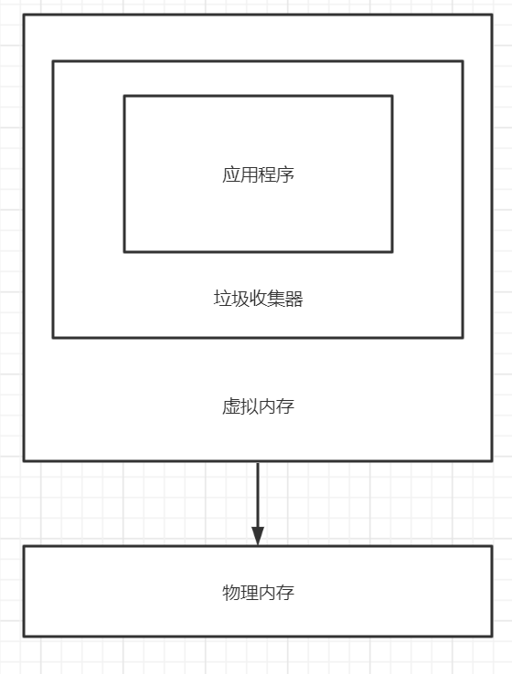
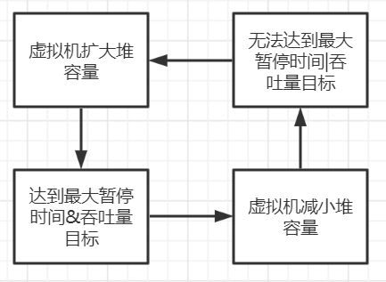
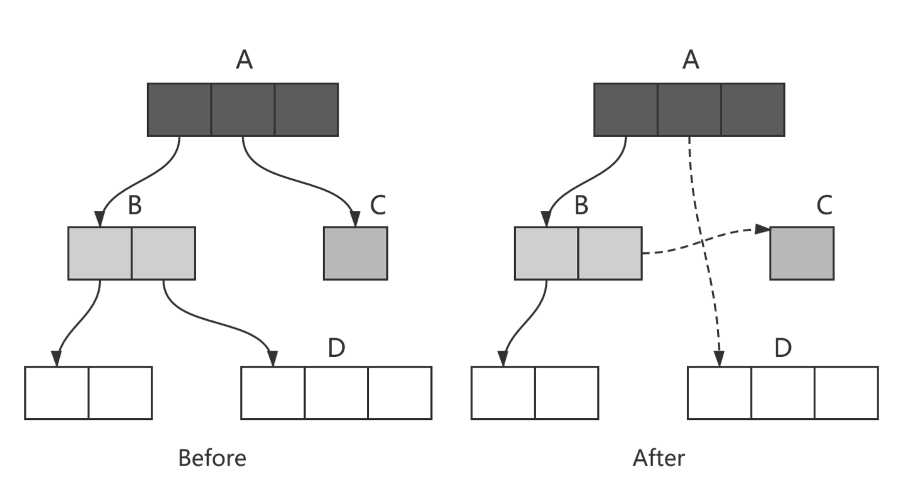
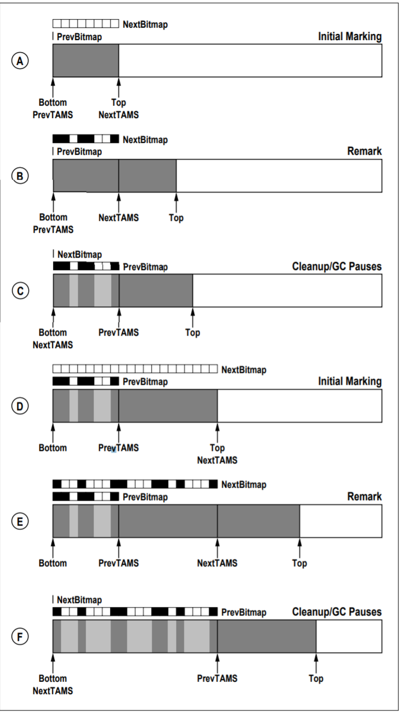

= 垃圾收集器

参考文档：
https://docs.oracle.com/en/java/javase/11/gctuning/introduction-garbage-collection-tuning.html#GUID-326EB4CF-8C8C-4267-8355-21AB04F0D304[Garbage Collection Tuning]     https://docs.oracle.com/en/java/javase/11/vm/java-virtual-machine-technology-overview.html#GUID-982B244A-9B01-479A-8651-CB6475019281[Java Virtual Machine Guide]

= 什么是垃圾收集器

可以理解为memory manager——应用程序的内存管理者

垃圾收集器通过这些操作管理内存::

. 从操作系统分配内存

. 根据请求，将内存分配给应用程序

. 确定已经分配给应用程序的内存中，哪部分仍在使用

. 回收未使用的内存，供应用程序重新使用

. 将内存返还给操作系统

基于垃圾收集器管理内存的应用程序，在操作系统上的内存分配模型如下图：

内存管理流程：

= 垃圾收集器关注的指标

最大暂停时间、吞吐量、内存占用量

**最大暂停时间**：单次垃圾收集占用的最大时间，影响用户线程单次的阻塞时间

**吞吐量**：依据垃圾收集时间在应用程序运行总时间中的占比衡量，公式：1 /（1+ GCTimeRatio），通过-XX: GCTimeRatio=19，将垃圾收集的目标设置为总时长的5%。

垃圾收集器中维护着这样一个动态循环：当满足最大暂停时间和吞吐量指标时，虚拟机会缩小堆，直到无法满足其中一个指标。

 

TIP: 由于jvm会动态调整堆的大小，尽量不要给堆设置最大值，可能会影响到性能。除非要设置比默认值更大的堆（默认是物理内存的1/4）

TIP: 如果达到最大内存限制，未达到吞吐量目标，加内存，加不动说明目标太高了

TIP: 这里还需要考虑到硬件性能，目前的大内存延迟会有比较高的访问延迟，对最大暂停时间、吞吐量都会有影响

TIP: 有些人认为Web服务器的正确度量标准是吞吐量，因为垃圾回收期间的暂停可能是可以容忍的，或者可能被网络等待时间掩盖了，但目前的虚拟机发展好像是朝着低延迟方向的，这里似乎还有争论

= 分代垃圾收集

简单的串行收集器：暂停用户线程，扫描存活对象，清理死亡对象。

**致命缺点**：存活对象多时，扫描暂停时间太久

**如何优化？**

基于weak generational hypothesis，引入分代（generation）

**分代垃圾收集器**

image::../resource/jsgct_dt_006_prm_gn_sz_new.png[]

初始化时，vm向操作系统申请Xmx大小的连续虚拟内存地址空间，按-XX: NewRatio=nnn，分配给年轻代和老年代。年轻代按-XX: SurvivorRatio=nnn，将年轻代分为1个eden和2个survivor

对象最初会被分配到eden

当年轻代空间用尽后，会发生一次只针对年轻代的回收，存活对象越少，回收越快，基于weak generational hypothesis，年轻代回收暂停时间会明显优于全堆回收。

引入分代之后，收集器会为每个对象维护一个年龄（age），对象每经历一次年轻代回收年龄会+1，达到某个阈值时，对象会被移动到老年代。这个过程称为衰老（aging）

通常每次年轻代回收过程中，一些幸存的对象会被移动到老年代，当老年代用尽，会发生一次老年代回收（全堆回收）

TIP: 大对象直接到老年代

= 影响gc性能的两个主要因素：Xmx、NewRatio

**Xmx**
在限定的Xmx下，vm会增大、减小堆以满足MinHeapFreeRatio（40%）和MaxHeapFreeRatio（70%）

如果年轻代或老年代的空闲内存小于40%，相应的代内存会增大，大于70%，会减小

TIP: 如何减小堆内存占用？减小MaxHeapFreeRatio

**NewRatio**

年轻代越大，年轻代gc频率越低，同时对象年龄增长周期变长，进入老年代的对象数占总对象数的比例会减少。

但在给定的Xmx下，老年代就要减小，可能增加老年代的gc频率，最佳方案要根据分配对象的生命周期确定

= 并发收集器(The Mostly Concurrent Collectors)

收集器与应用程序并发的执行部分工作，因此得名。

- CMS

- G1

收集器用处理器资源(app使用的)换取更短暂的暂停时间（major collection pause time）。

并发收集器的开销::

- 主要开销是并发收集部分，会使用更多的处理器资源。

- 开启并发也会有额外的开销。（这里通常导致并发收集器的停顿时间虽然短，但是吞吐量也往往比其他收集器低）。

在多核处理器上，app线程在整个并发收集阶段都是可获得cpu的，因为垃圾收集线程并不会暂停app。结果通常是停顿时间短，但是更少的处理器资源被用于app，app会减速（吞吐量降低）

由于在并发阶段，最少有一个处理器被用于垃圾收集，并发收集器通常不能让单处理器（1个核心）的机器受益

== G1

=== 介绍

G1收集器是为多核、大内存的机器设计的，G1要达到的目标是：几乎不需要配置，使当前应用程序，高概率的达到暂停时间目标，同时达到高吞吐量。在延迟与吞吐量之间达到最佳的平衡。

G1在jdk9中成为默认收集器

G1的特点::

- 堆空间支持到10GB或更大，超过50%的堆空间中是存活数据。

- 随着时间推移，对象分配和晋升的比例会发生显著变化。

- 不超过几百毫秒的可预测暂停时间，避免长时间的暂停。

=== 基本概念

**下定义**

G1 is a generational, incremental, parallel, mostly concurrent, stop-the-world, and evacuating garbage collector which monitors pause-time goals in each of the stop-the-world pauses. 

和其他收集器一样，G1将堆划分为年轻代和老年代，空间回收主要集中在年轻代，偶尔发生在老年代。

为了提高吞吐量，一些操作总是stw。为了缩短stw，另外一些操作与app并行、并发执行（例如 global marking）。

为保持stw时间短暂，G1增量、分步、并行的执行垃圾回收。

G1通过追踪app以前的行为和gc停顿为相关成本建模，实现可预测性。G1通过这些信息规划在暂停时完成的工作。

G1通过疏散（evacuation）回收空间。在被选择的回收区域中找到活对象，复制到新的内存区域（标记复制），在这个过程中压缩对象的总占用空间。在疏散完成后，之前被占用活对象占用的空间将被重新用于应用程序分配。

=== 堆布局

G1将堆划分为一组相同尺寸的region，每一段连续的虚拟内存空间都像下图这样。region是内存分配和回收的单位。在任何时间，这些region可以是空的，或者被指定一个特定的分代（年轻代/老年代）。当有内存请求时，G1的内存管理机制会先给一些空闲的region指定分代，然后将它们分发给app，app可以自己控制这些region内部空间的分配。

image::G1_heap_layout.png[G1 heap layout]

图解析::

. 灰色区域代表空的region

. 红色区域代表年轻代region，普通红色代表eden region，带有S的红色代表survivor region。

. 蓝色区域代表老年代，带有H的蓝色代表存放大对象的老年代。

在其他收集器中，eden、servivor、old通常使用连续虚拟内存空间，在G1中，这些区域通常不采用连续的布局模式。

内存管理机制总是将年轻代的eden region分配给app，特例是大对象将直接分配到老年代。
 
G1垃圾收集暂停可以回收整个年轻代，并且额外回收部分老年代
 
G1将collection set中的活对象分配到一个或多个不同的空region，整个年轻代将被复制到survivor或者old，old到其他old。

=== 垃圾收集循环（garbage collection cycle）

从较高的层面看，G1在两个阶段中交替::

- young-only phase：只回收年轻代，这会导致堆中老年代region的比例变大。

- space-reclamation phase：除了回收年轻代，G1还会增量的回收老年代。

image::G1_garbage_collectio_cycle.png[]

young-only phase::

* 这个阶段从几次Normal young collections开始（Pause Young (Normal) (G1 Evacuation Pause)）。对象不断进入老年代，当老年代占比达到一定阈值（Initiating Heap Occupancy threshold）时，开始从young-only过渡到space-reclamation。这时，G1安排一次Concurrent Start young collection代替一次Normal young collection。

** Concurrent Start：在执行一次Normal young collection的基础上，额外启动标记过程（marking process）。并发（concurrent marking）标记确定所有老年代中当前可达的对象，用于在space-reclamation phase保留它们。在并发标记过程中，可能同时发生Normal young collection。标记过程（marking processmarking process）中有两次stw停顿：remark、cleanup。

*** remark：这次停顿结束标记过程，执行全局引用处理和类卸载。回收空region、清理内部数据结构。在remark和cleanup之间，G1计算一些信息（以便于在之后能够并发的回收空闲的老年代区域），这个过程在cleanup停顿中结束。

*** cleanup：这次停顿决定是否将要进入space-reclamation phase。如果将要进入space-reclamation phase，young-only phase将已一次Prepare Mixed young collection结束。

space-reclamation phase::

* 这个阶段由多个Mixed collection组成，Mixed collection同时疏散（evacuate）年轻代和老年代有对象存活的region。当G1认为疏散更多老年代region不能产生足够多的空闲空间时，space-reclamation phase结束。

space-reclamation phase结束后，收集循环将重新由一次young-only phase开始。

如果在收集活动信息时（标记阶段）发生oom，G1将直接执行一次Full GC。

=== G1内部细节

* 确定IHOP

Initiating Heap Occupancy Percent (IHOP) 是触发初始标记收集的阈值，定义为老年代大小的百分比。

默认情况下，G1通过观察标记周期中标记任务所需的时间和老年代分配多少内存来自动确定最佳的IHOP。这个特性被成为Adaptive IHOP。当没有足够的观察数据能用来很好的预测IHOP时，会使用-XX:InitiatingHeapOccupancyPercent设置的值。可以使用-XX:-G1UseAdaptiveIHOP关闭Adaptive IHOP

* 标记（marking）

G1 标记使用**Snapshot-At-The-Beginning (SATB)**算法。在Initial Mark停顿时，G1获得一个虚拟的堆快照。在标记开始时，所有活对象将在剩下的标记过程中被认为是存活的。这意味着在标记过程中死亡的对象为了空间回收的目的仍然被认为是活的（有一些例外）。这可能错误的保留一些额外的内存空间。但是SATB潜在的减少了remark阶段的停顿时间。这些对象将在下一次marking过程中被回收。

关于marking，详见 https://docs.oracle.com/en/java/javase/11/gctuning/garbage-first-garbage-collector-tuning.html#GUID-90E30ACA-8040-432E-B3A0-1E0440AB556A[Garbage-First Garbage Collector Tuning]

* 在非常密集堆情景下的行为

当应用程序持有大量的活动内存区域，G1疏散不能找到足够的空间去复制对象，就会发生**evacuation failure**。evacuation failure意味着G1只能尽力去完成当这次垃圾收集：将所有已经移动的对象保存在新位置。不复制任何尚未移动的对象，只调整对象之间的引用。evacuation failure可能导致一些额外的开销，但通常应该和其他年轻代收集一样快。在这次垃圾收集之后，G1将不采取任何其他措施，直接恢复应用程序。G1假设疏散失败发生在垃圾收集接近结束时;也就是说，大多数对象已经被移动，并且有足够的空间继续运行app，直到marking完成，space-reclamation 阶段开始。如果假设不成立（没有足够的空间运行app），会发生一次Full GC。

关于 evacuation failure、提前触发的Full GC
详见 https://docs.oracle.com/en/java/javase/11/gctuning/garbage-first-garbage-collector-tuning.html#GUID-90E30ACA-8040-432E-B3A0-1E0440AB556A[Garbage-First Garbage Collector Tuning]

* 大对象

大对象：object size >= (region size) / 2

通过-XX:G1HeapRegionSize设置region size

大对象会被特殊处理::

- 大对象会被分配到老年代的一系列连续region。对象的起始地址是这一系列region中第一个region的起始地址。最后一个region中的剩余空间不会再被分配，直到这个对象被回收。

- 在大对象多的情况下，要适当调整region size。例如region size = 16m，有大量object size = 10m的对象，会导致大量的空间浪费

- 通常大对象只能在marking阶段结束时的cleanup pause中被回收（或者Full GC）。

- 但是对于基本类型的数组，如果没有被很多对象应用，G1将适时的尝试去回收数组对象（可能在任何一种垃圾收集停顿时发生）。通过-XX:G1EagerReclaimHumongousObjects.关闭。

- 分配大对象可能导致提前发生垃圾收集暂停。在每次大对象分配时，G1会检查IHOP，如果超出，就会立刻强制发生一次initial mark young collection

- 大对象不会被移动，即使在Full GC中。这可能导致过早发生Full GC、又碎片化内存引起的意想不到的oom。

[%hardbreaks]

* Young-Only Phase 分代大小调整

在young-only阶段，collection set只由年轻代的region组成。G1总是在normal young collection结束后（会有对象进入到老年代）重新衡量年轻代，观测指标IHOP，判断是否进入到下一阶段。这个阶段，G1将根据对实际暂停时间的长期观察，去达到暂停时间目标（通过-XX:MaxGCPauseTimeMillis、-XX:PauseTimeIntervalMillis设置）。

G1在-XX:G1NewSizePercent、-XX:G1MaxNewSizePercent 这两个值之间调整年轻代大小，以达到暂停时间目标。

关于 如何处理long pause
详见 https://docs.oracle.com/en/java/javase/11/gctuning/garbage-first-garbage-collector-tuning.html#GUID-90E30ACA-8040-432E-B3A0-1E0440AB556A[Garbage-First Garbage Collector Tuning]

Space-Reclamation Phase 分代大小调整

在space-reclamation阶段，G1尝试在一次暂停中最大化的回收老年代空间。

年轻代会被调整到最小值（-XX:G1NewSizePercent），在G1认为添加更多的region将超出停顿时间目标之前，所有的需要回收的老年代region都将被添加到collection set candidates。在一次特定的停顿中，G1将根据回收效率和剩余时间，从集合中获得最终回收的collection set。

(collection set candidates) / XX:G1MixedGCCountTarget（阶段中执行mixedGC回收的最大次数） 得出每次gc回收老年代region的数量。collection set candidates的最大值，要低于-XX:G1MixedGCLiveThresholdPercent

当collection set candidates中可以被回收的剩余空间小于-XX:G1HeapWastePercent时，Space-Reclamation Phase结束。

=== 一些参数的默认值

-XX:MaxGCPauseMillis=200::
最大停顿时间目标

-XX:GCPauseTimeInterval=<ergo>::
最大暂停间隔目标，没有默认值，允许G1在极端情况时候连续发生gc

-XX:ParallelGCThreads=<ergo>::
gc停顿时候的最大并行线程数，当进程可以使用的cpu线程数小于等于8时，等于可使用线程数，大于8时：8 + （可使用线程数 - 8） * （5 / 8）。在每次gc停顿开始时候，gc线程的最大并行线程数量会进一步受到-XX:HeapSizePerGCThread（每xxx的堆空间提供一个gc线程）限制，线程数不会超过 总堆 / HeapSizePerGCThread。

-XX:ConcGCThreads=<ergo> ::
最大并发gc线程数，默认是-XX:ParallelGCThreads / 4

-XX:+G1UseAdaptiveIHOP -XX:InitiatingHeapOccupancyPercent=45::
使用自适应IHOP，默认开启。在前几个collection cycle（没有足够多的观测数据） G1用老年代占45%作为阈值。

-XX:G1HeapRegionSize=<ergo> ::
设置region的大小，默认结果是堆大约包含2048个region（默认算法startingHeapSize/2048），region size可以在1MB-32MB之间调整，必须是2的次幂

-XX:G1NewSizePercent=5 -XX:G1MaxNewSizePercent=60::
年轻代空间范围 (G1NewSizePercent, G1MaxNewSizePercent)，默认(5,60)

-XX:G1HeapWastePercent=5::
允许不回收的collection set candidates占总堆的比率，默认如果collection set candidates占堆的比率小于5%，就会结束space-reclamation phase，不会执行mixed gc

-XX:G1MixedGCCountTarget=8::
space-reclamation phase阶段预期的gc次数，默认是8次

-XX:G1MixedGCLiveThresholdPercent=85::
老年代region中，活对象的比率超过G1MixedGCLiveThresholdPercent（默认85%）时，space-reclamation phase将不会回收这个region

关于 G1老年代将要使用多少，如何避免long mixed collection pauses
详见 https://docs.oracle.com/en/java/javase/11/gctuning/garbage-first-garbage-collector-tuning.html#GUID-90E30ACA-8040-432E-B3A0-1E0440AB556A[Garbage-First Garbage Collector Tuning]

=== 关键的数据结构、机制

==== TLAB（Thread-Local Allocation Buffers）

解决多多线程在堆上分配对象时的竞争问题

线程从堆中申请一段缓冲区，用于线程本地分配对象，TLAB内部有3个指针，start、top、end，start、end用于标记TLAB的边界，top用于区分已使用和未使用区域。当TLAB中剩余空间无法容纳当前分配对象时，  可能分配在TLAB外，也可能申请一个新的TLAB，通过一些参数可以配置。

==== 三色标记（tricolor marking）

实现了gc线程与app线程的并发执行，解决了传统mark-and-sweep收集器在整个gc期间需要STW，全堆扫描的问题。

form why:

在标记过程中，按照对象是否被访问过，将对象标记为三种颜色：

白色：表示对象尚未被垃圾回收器访问过。

黑色：表示对象已经被垃圾回收器访问过，且这个对象的所有引用都已经扫描过。

灰色：表示对象已经被垃圾回收器访问过，但这个对象至少存在一个引用还没有被扫描过。

from wiki:

将对象划分到三个集合中：

白色：本次回收的候选对象集合。

黑色：没有指向白色集合指针，且从root可达 的对象集合。（黑色集合中的对象不是回收的候选对象，不会被回收）。

灰色：根可达，但是还没有扫描该对象拥有的白色对象引用的对象集合。灰色集合中的对象最终都会变成黑色对象。

主要流程：

1.初始时，将所有root引用对象放入灰色集合，其他对象放入白色集合

2.灰色集合中任选一个对象，放入黑色集合中。

3.将该对象所有直接引用的白色对象放入灰色集合

4.重复2 3，直到灰色集合为空。

最终，灰色集合为空，黑色集合中的对象是root可达的，不能被回收，白色集合中的对象是root不可达的，可以被回收。

the tri-color invariant：

三色标记提供的一个重要特性，黑色集合的对象不能直接指向白色集合，这确保了当灰色集合为空时，白色集合的对象都可以被回收。

image::Animation_of_tri-color_garbage_collection.gif[Animation_of_tri-color_garbage_collection]

标记过程中，由于引用的变动，会导致两种问题

1：黑色到灰色/黑色到黑色的引用断开，导致实际应该被回收的对象为被回收，这些对象被称为**浮动垃圾**。

2：同时满足一下两个条件时，会导致**对象丢失**，最终对象图遍历不完全。

条件一：赋值器插入了一条或者多条从黑色对象到白色对象的新引用。

条件二：赋值器删除了全部从灰色对象到该白色对象的直接或间接引用。

image::tricolor_marking_lose_object_v2.png[tricolor_marking_lose_object_v2]

==== Remembered Set

region中被划分为多个card table。cardtable将512个byte映射到1个byte，对region中的部分连续空间中的对象进行聚合，粒度变粗，提升在region中查找对象的效率。

每一个region拥有一个RSet，用于记录所有引用了该region对象的region及其中的card table index。RSet是card的集合，由hashtable实现（实际为了支持并行GC，每个region拥有一个由多个hashtable组成的数组，从而允许多个线程互不影响的更新RSet，从上层看，在逻辑上这多个hashtable的并集表现为一个hashtable）

当app线程更改对象引用时，app线程通知到collector线程哪个**card table**发生了变更。

===== Remember Set Write Barrier

在指针的写操作之后，会执行Remember Set Write Barrier（Barrier听起来很牛，其实就是一个post操作）。

**Remember Set Write Barrier**

以执行x.f = y为例，如果x.f指针写操作前后的两个对象在一个region中，不需要执行任何操作。如果不在同一个region中，表示创建了一个out-of-region pointer，会执行rs_enqueue方法，读取x对象所在的card，如果是dirty，不执行任何操作（这里聚合了一个卡表上的多次操作，在向空卡表写入时，这种情况会频繁发生）。如果card is not dirty，将他标记为dirty，将这个card记录到当前线程的一个buffer中(remembered set log queue)。如果buffer满了（默认256），buffer会被放到一个global set 中，再给当前线程分配一个空队列。

简单说就是当发生指针写操作时，将card加入到buffer中，其中做了一些优化操作。

===== remembered set thread

当global buffer set size到达阈值时（默认5），remembered set thread会处理buffer，把buffer当作队列，一个个的处理队列中的card。直到global buffer set size减小到阈值的1 / 4。

hot card: 被频繁修改的card。为了避免频繁处理hot card，用一个新的card table记录 从上一次evacuation pause起，这个card被标记为dirty的次数。remembered set thread每处理一个card，这个card的次数就会+1。当count达到hotness threshold（默认4）时，这个card会被加入到hot queue（默认大小1k），在evacuation pause开始时候，hot queue会被处理掉。如果queue满了，会从queue中取出第一个card处理掉。

如何处理dirty card？remembered set thread先将card置为clean，后续的修改都将重新把card置为dirty。之后找到所有发生变化的指针中指向当前region外的指针，将当前region、当前card记录到外部region的RSet中。

==== Evacuation Pauses

STW，将collection set中region里的或对象复制到新的region中，并释放region。对象复制移动的动作，对于app线程必须是原子的，在并发系统中实现这种原子操作代价很大，所以被安排在STW中执行。

Evacuation Pauses中GC工作的主要流程：串行（sequentially）构建出一个collection set，并行启动多个线程，去竞争执行多个任务（处理log buffer，更新RSet，疏散活对象等task）。每个任务只有一个线程去执行，线程间没有同步。

在复制对象到新的region时，如何做到高效并行，均衡负载？使用了GCLAB，GC线程的本地缓冲，类似TLAB，GC线程先复制一个旧对象到GCLAB，然后线程建竞争去在老对象上设置一个转发指针，转发到复制的对象上，竞争成功的线程负责这个对象的复制和后续的依赖指针切换等工作。

==== Concurrent Marking

在Comcurrent Marking中，构成的collection set内部排序如何实现的garbage first？

==== SATB

SATB是Concurrent Marking中一个重要的数据结构，通过两个bitmap实现。

previous bitmap: 记录的是上一次concurrent marking阶段完成时，标记完成最终产生的bitmap。

next bitmap: 仅在marking过程中存在，是一个构建中的bitmap。

===== TAMS (top at mark start)

每个regin有两个TAMS指针，nextTAMS指向这次concurrent marking开始时，region使用的top位置（也是next bitmap的top），preTAMS指向pre bitmap的top。

在initial marking 停顿中，preTAMS指向bottom，NextTAMS指向top。此时初始化出一个空的next bitmap，其覆盖范围是bottom到nextTAMS。每一个region都拥有一个next bitmap，包含了所有在initial marking发生时，region中已使用的对象，即用这些bitmap创建出了一个marking开始是的对的镜像，即**SATB**。在initial marking阶段，初始化的next bitmap中，所有的对象即对应三色标记中的所有白色对象。所有GCRoot直接关联的对象，即对应三色标记中的灰色对象。

initial marking结束后，进入concurrent marking阶段，即从GCRoot出发，遍历对象图，将GCRoot可达的对象对应的bitmap位置进行标记，并发标记完成时，所有bitmap中被标记的位置，映射到的对象就对应三色标记中的黑色，为标记的对象对应白色（**在不考虑黑色对象指针变动的情况下，可能因为指针变动产生对象消失**）。同时，在并发标记期间，新创建的对象，由于不在bitmap映射的范围内，所以不参与标记与回收，在下一次的标记过程中才会被处理。这些对象中的垃圾对象被成为浮动垃圾。

之后，进入remark阶段，处理在concurrent marking阶段发生引用变更的对象。

之后进入clean up阶段，此时marking阶段完成，next bitmap构建完成，与pre bitmap互换，即next bitmap变为pre bitmap，next bitmap在下次标记开始时候清空。

至此，prebitmap中就标记除了每一个region中的黑色对象与白色对象，在下一个阶段执行的多次mixed GC中回收。

参考：G1论文，why的推文 https://mp.weixin.qq.com/s/tWsuQ0HD3RAiKzS-w6giqQ[1] https://mp.weixin.qq.com/s/p3xBnZw-kjRXTH0J-6Rmyw[2]

==== Concurrent Marking Write Barrier

解决在并发标记期间，由于黑色对象

参考：G1论文，https://hllvm-group.iteye.com/group/topic/44381

=== G1 step by step(基于jdk7，新版本可能有些许变化)

- G1堆结构

G1 heap 被分为许多固定大小的region
image::G1_heap_structure.png[G1_heap_structure]

- G1堆分配

region被设计用于并行收集

image::G1_heap_allocation.png[G1_heap_allocation]

- G1的年轻代收集

初始堆
image::young_generation_in_G1.png[young_generation_in_G1]

young GC发生(STW)

活对象被疏散到一个或多个survivor region，到达年龄阈值的对象会晋升到老年代。
image::a_young_GC_in_G1.png[a_young_GC_in_G1]

young GC结束
image::end_of_young_GC_with_G1.png[end_of_young_GC_with_G1]

==== G1 concurrent marking cycle phases

. **Initial Mark(STW)**在发生一次young GC的基础上，标记有引用老年代对象的survivor region(root region)

. **Root Region Scanning**扫描survivor region获取老年代的引用。与app并发执行，必须在下一次young GC发生之前完成。

. **Concurrent Marking**标记全堆中的活对象，与app并发执行，这个阶段可能被young GC打断。

. **Remark(STW)**使用SATB

. **Cleanup(STW)**记录活对象和空region(STW)；清理remember set(STW)；重置空region，并放到free list

. **Copying(STW)**把活对象疏散到未使用的region，可能发生在young GC、mixed GC

==== G1 Old Generation Collection Step by Step
image::initial_marking_phase.png[initial_marking_phase]
image::concurrent_marking_phase.png[concurrent_marking_phase]
image::remark_phase.png[remark_phase]
image::copying_or_cleanup_phase.png[copying_or_cleanup_phase]
image::after_cupying_or_cleanup_phase.png[after_cupying_or_cleanup_phase]

=== G1实现了高性能，G1通过哪些方法去达到暂停时间目标？

以分步、并行的方式增量的进行垃圾回收

* 从 CMS 或者 ParallelOldGC迁移到G1，jvm进程可能会占用更多的内存。因为G1内部使用了一些"accounting" data structures(例如 Remembered Sets and Collection Sets)。

* Remembered Sets: 追踪region中对象的引用，每个region拥有一个Remembered Set。

* Collection Sets: 将在gc中被回收的region的集合。Collection Sets中的所有活对象将在一次gc中被疏散。

参考：
https://docs.oracle.com/en/java/javase/11/gctuning/garbage-first-garbage-collector.html#GUID-ED3AB6D3-FD9B-4447-9EDF-983ED2F7A573[Garbage-First Garbage Collector]

https://www.oracle.com/technetwork/tutorials/tutorials-1876574.html[Getting Started with the G1 Garbage Collector]

== CMS

=== CMS Collection Phases

. **Initial Mark(STW)**: 标记老年代中，直接被年轻代对象引用的可达对象。停顿时间通常比minor collection pause短

. **Concurrent Marking**: 与app并发，遍历老年代对象图。用Initial Mark阶段标记的老年代对象作为root，遍历标记所有可达的老年代对象。在2、3、5阶段中分配和晋升的对象都将直接被标记为活跃。

. **Remark(STW)**: 标记在Concurrent Marking阶段由于app运行导致对象更新，被遗漏的对象。

. **Concurrent Sweep**: 回收在marking阶段被认为不可达的对象（注意 这里不可达对象不是被标记的对象）。不可达对象集合的空间会被添加到一个free list用于之后分配。不可达对象空间合并也发生在这里。注意：**活对象不会被移动，会导致碎片化，直到Full GC发生**

. **Resetting**: 清理vm内部的数据结果，为下一次concurrent collection做准备

=== Reviewing CMS Step By Step

. CMS的堆结构

年轻代被分为一个Eden和两个survivor。老年代是一块连续的虚拟内存空间。GC在适当的位置发生。直到Full GC发生才会整理老年代。

image::CMS_heap_structure.png[CMS_heap_structure]

. young GC如何与CMS一起工作

如果app已经运行了一段时间，堆空间可能入下图，对象分散在老年代。存活的老年代对象不会被移动，新的老年代对象会被分配到适当的位置。

. 年轻代回收

活对象从Eden、survivor复制到另一个survivor。达到年龄阈值的对象将晋升到老年代。

image::young_generation_collection.png[young_generation_collection]

. 年轻代回收之后

Enen和其中一个survivor将会被清空

image::after_young_gc.png[after_young_gc]

. CMS的老年代回收

当老年代达到一定使用率后，CMS被触发（包含initial mark、remark两个STW阶段）。

initial mark阶段短暂停顿，标记年轻代可达的老年代对象。

concurrent marking阶段，与app并发进行，标记出活对象。

remark阶段标记出concurrent marking阶段遗漏的对象。

image::old_gen_collection_in_CMS.png[old_gen_collection_in_CMS]

. Concurrent Sweep

没有被标记的对象会被清理。不会整理老年代

未标记对象 == 死亡对象

. After Sweeping

image::old_gen_collection-concurrent_sweep.png[old_gen_collection-concurrent_sweep]

sweeping phase之后，很多内存被释放，也会发现多了很多的碎片空间

最后CMS会经过resetting阶段，等待下一次达到GC阈值。

