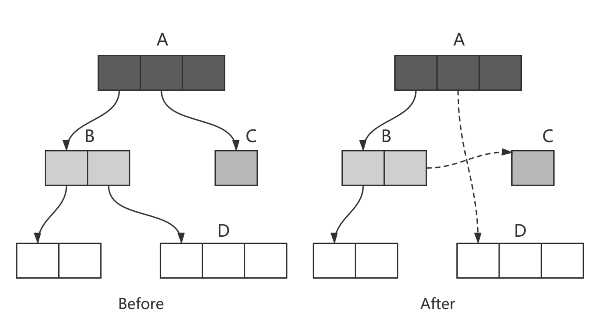
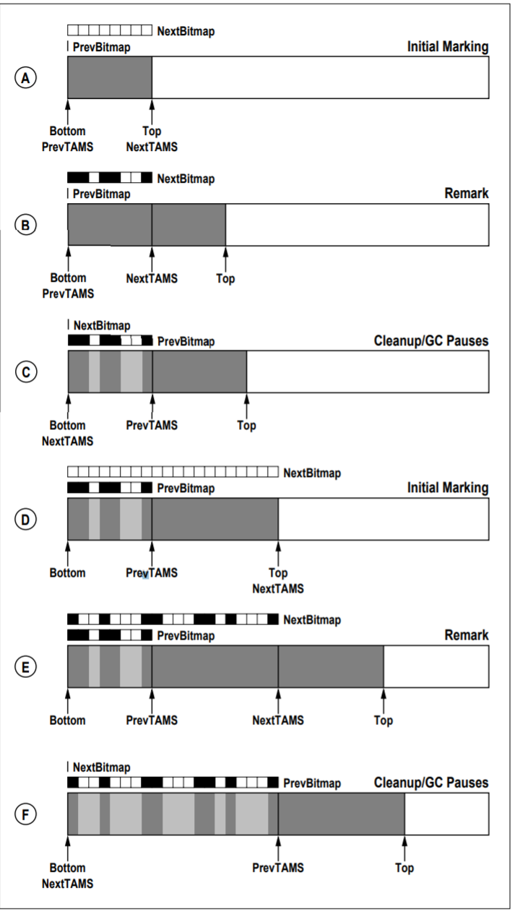

= G1并发标记

== 遗留问题

- 并行与并发的区别

[quote, Wiki, Parallel computing]
____
Parallel computing is a type of computation in which many calculations or processes are carried out simultaneously. Large problems can often be divided into smaller ones, which can then be solved at the same time.
____

[quote, Wiki, Parallel computing]
____
In parallel computing, a computational task is typically broken down into several, often many, very similar sub-tasks that can be processed independently and whose results are combined afterwards, upon completion. In contrast, in concurrent computing, the various processes often do not address related tasks; when they do, as is typical in distributed computing, the separate tasks may have a varied nature and often require some inter-process communication during execution.
____

== 三色标记（tricolor marking）

实现了gc线程与app线程的并发执行，解决了传统mark-and-sweep收集器在整个gc期间需要STW，全堆扫描的问题。

将对象划分到三个集合中：

白色：本次回收的候选对象集合。

黑色：没有指向白色集合指针，且从root可达 的对象集合。（黑色集合中的对象不是回收的候选对象，不会被回收）。

灰色：根可达，但是还没有扫描该对象拥有的白色对象引用的对象集合。灰色集合中的对象最终都会变成黑色对象。

主要流程：

1.初始时，将所有root引用对象放入灰色集合，其他对象放入白色集合

2.灰色集合中任选一个对象，放入黑色集合中。

3.将该对象所有直接引用的白色对象放入灰色集合

4.重复2 3，直到灰色集合为空。

最终，灰色集合为空，黑色集合中的对象是root可达的，不能被回收，白色集合中的对象是root不可达的，可以被回收。

the tri-color invariant：

三色标记提供的一个重要特性，黑色集合的对象不能直接指向白色集合，这确保了当灰色集合为空时，白色集合的对象都可以被回收。

image::resource/Animation_of_tri-color_garbage_collection.gif[Animation_of_tri-color_garbage_collection]

标记过程中，由于引用的变动，会导致两种问题

1：黑色到灰色/黑色到黑色的引用断开，导致实际应该被回收的对象为被回收，这些对象被称为**浮动垃圾**。

2：同时满足一下两个条件时，会导致**对象丢失**，最终对象图遍历不完全。

条件一：赋值器插入了一条或者多条从黑色对象到白色对象的新引用。

条件二：赋值器删除了全部从灰色对象到该白色对象的直接或间接引用。

== SATB

SATB用来维护Concurrent Marking的正确性，通过两个bitmap实现。

previous bitmap: 记录的是上一次concurrent marking阶段完成时，标记完成最终产生的bitmap。

next bitmap: 仅在marking过程中存在，是一个构建中的bitmap。

=== TAMS (top at mark start)

每个regin有两个TAMS指针，nextTAMS指向这次concurrent marking开始时，region使用的top位置（也是next bitmap的top），preTAMS指向pre bitmap的top。

在initial marking 停顿中，preTAMS指向bottom，NextTAMS指向top。此时初始化出一个空的next bitmap，其覆盖范围是bottom到nextTAMS。每一个region都拥有一个next bitmap，包含了所有在initial marking发生时，region中已使用的对象，即用这些bitmap创建出了一个marking开始是的对的镜像，即**SATB**。在initial marking阶段，初始化的next bitmap中，所有的对象即对应三色标记中的所有白色对象。所有GCRoot直接关联的对象，即对应三色标记中的灰色对象。

initial marking结束后，进入concurrent marking阶段，即从GCRoot出发，遍历对象图，将GCRoot可达的对象对应的bitmap位置进行标记，并发标记完成时，所有bitmap中被标记的位置，映射到的对象就对应三色标记中的黑色，为标记的对象对应白色（**在不考虑黑色对象指针变动的情况下，可能因为指针变动产生对象消失**）。同时，在并发标记期间，新创建的对象，由于不在bitmap映射的范围内，所以不参与标记与回收，在下一次的标记过程中才会被处理。这些对象中的垃圾对象被成为浮动垃圾。

之后，进入remark阶段，处理在concurrent marking阶段发生引用变更的对象。

之后进入clean up阶段，此时marking阶段完成，next bitmap构建完成，与pre bitmap互换，即next bitmap变为pre bitmap，next bitmap在下次标记开始时候清空。

至此，prebitmap中就标记除了每一个region中的黑色对象与白色对象，在下一个阶段执行的多次mixed GC中回收。

== Concurrent Marking Write Barrier

解决在并发标记期间，由于 新增由某黑色对象到白色对象的引用且同时删除所有灰色对象到该白色对象引用 而导致对象丢失的问题。

G1会设置一个写前屏障，伪代码如下：

1| rTmp := load(rThread + MarkingInProgressOffset)

2| if (!rTmp) goto filtered

3| rTmp := load(rX + FieldOffset)

4| if (rTmp == null) goto filtered

5| call satb_enqueue(rTmp)

6| filtered:

第1、2行检查当前是否在标记过程中，不在标记过程中跳过。这一步跳过了大多数指针修改。

第3、4行判断指针指向的旧对象是否为空，为空则跳过。在大多数程序中，对象一般都是先初始化为一个null值，之后在对其进行赋值，这里判空是一个很有效的过滤方法。

第5行，把指针指向的就对象放入到线程私有的 current marking buffer。类似 remembered set buffer，如果线程本地的buffer满了，这个buffer会被放到global set of completed marking buffers。concurrent
marking thread定期的检查global set的size，中断堆遍历去处理这些buffer。

这个写屏障是基于Real-time garbage collection on general-purpose machines, Taiichi Yuasa（湯淺 太一） 这篇论文
论文中的pre-write barrie抽象逻辑：
[source,c++]
void pre_write_barrier(oop* field) {  
  if ($gc_phase == GC_CONCURRENT_MARK) { // SATB invariant only maintained during concurrent marking  
    oop old_value = *field;  
    if (old_value != null && !is_marked(old_value)) {  
      mark_object(old_value);  
      $mark_stack->push(old_value); // scan all of old_value's fields later  
    }  
  }  
} 

其中is_marked(old_value)检查旧对象是否被标记过，$mark_stack->push(old_value)标记所有旧对象引用的对象。这两个动作实际在G1的写前屏障中没有做，都放在buffer中处理。

看到这里，可以发现G1中，指针写操作的barrier实际如下：
[source,c++]
----
void oop_field_store(oop* field, oop new_value) {  
  pre_write_barrier(field);             // pre-write barrier: for maintaining SATB invariant  
  *field = new_value;                   // the actual store  
  post_write_barrier(field, new_value); // post-write barrier: for tracking cross-region reference  
}  
----

写前屏障用来维护SATB，写后屏障用来维护remembered set。

=== logging write barrier

为了尽量减少write barrier对mutator性能的影响，G1将一部分原本要在barrier里做的事情挪到别的线程上并发执行。
实现这种分离的方式就是通过logging形式的write barrier：mutator只在barrier里把要做的事情的信息记（log）到一个队列里，然后另外的线程从队列里取出信息批量完成剩余的动作。

以SATB write barrier为例，每个Java线程有一个独立的、定长的SATBMarkQueue，mutator在barrier里只把old_value压入该队列中。一个队列满了之后，它就会被加到全局的SATB队列集合SATBMarkQueueSet里等待处理，然后给对应的Java线程换一个新的、干净的队列继续执行下去。

并发标记（concurrent marker）会定期检查全局SATB队列集合的大小。当全局集合中队列数量超过一定阈值后，concurrent marker就会处理集合里的所有队列：把队列里记录的每个oop都标记上，并将其引用字段压到标记栈（marking stack）上等后面做进一步标记。即把buffer中的对象放入灰色集合中。
