= mysql
:toc: left
:toclevels: 5
:toc-title: 目录

== 读现象

* 脏读
** 当前事务可以读到其他事务修改但尚未提交的数据行
* 不可重复读
** 当前事务中，读取同一行数据两次，读取的结果不同。在两次读中的时间段，这行数据被其他事务修改并提交。一般发生在读时候不上读锁或者执行完读操作，但事务还没提交就释放读锁的情况下。
* 幻读
** 当前事务中，两次读取中的时间段，由其他事务新增或删除相关数据，导致两次读取数据数量不同。

不可重复读与幻读的区别
[quote]
____
Non-repeatable reads are when your transaction reads committed **UPDATES** from another transaction. The same row now has different values than it did when your transaction began.

Phantom reads are similar but when reading from committed **INSERTS** and/or **DELETES** from another transaction. There are new rows or rows that have disappeared since you began the transaction.
____

== 事务隔离级别

* 串行化
** 避免一切读现象
* 可重复读
** 发生幻读
* 读已提交
** 发生幻读、不可重复读
* 读未提交
** 发生幻读、不可重复读、脏读

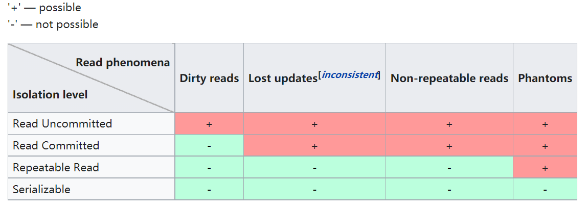

== mysql体系结构
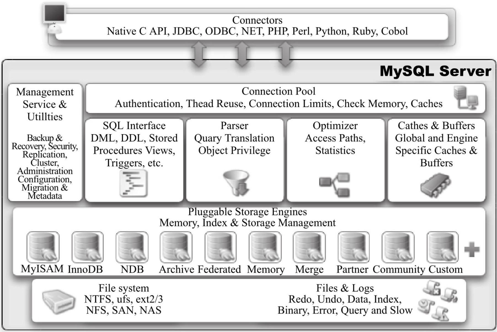

MySQL由以下几部分组成::

- 连接池组件□ 管理服务和工具组件
- SQL接口组件
- 查询分析器组件
- 优化器组件
- 缓冲（Cache）组件
- 插件式存储引擎
- 物理文件

**存储引擎是基于表的，不是基于数据库的

== innoDB存储引擎体系结构

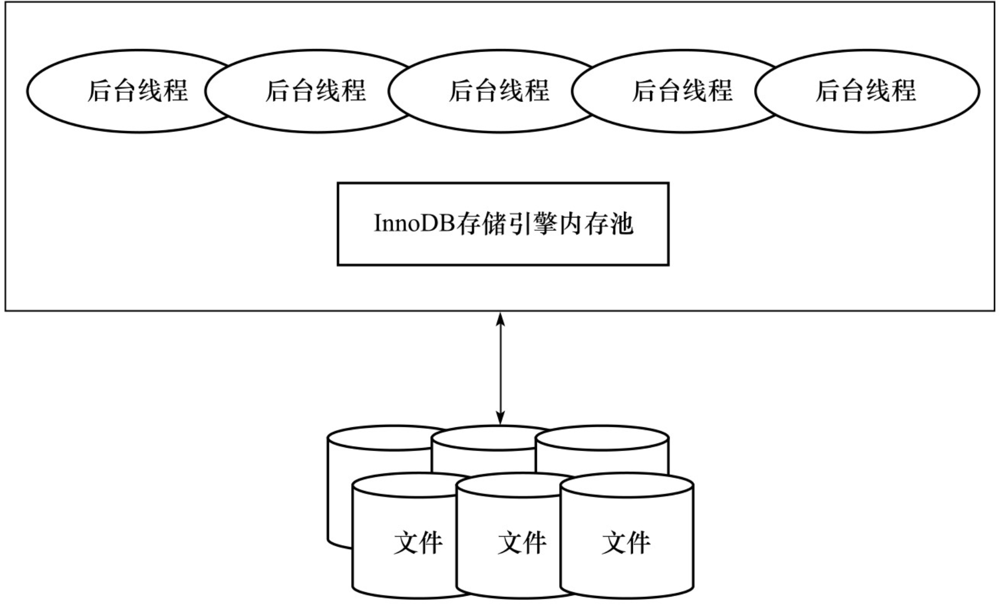

=== 后台线程

* Master Thread
** 主要负责将缓冲池中的数据异步刷新到磁盘，保证数据的一致性，包括脏页的刷新、合并插入缓冲（INSERTBUFFER）、UNDO页的回收等

* IO Thread
** 负责这些IO请求的回调（call back）处理

* Purge Thread
** 回收undo页

* Page Cleaner Thread
** 刷新脏页

=== 内存

==== InnoDB内存结构

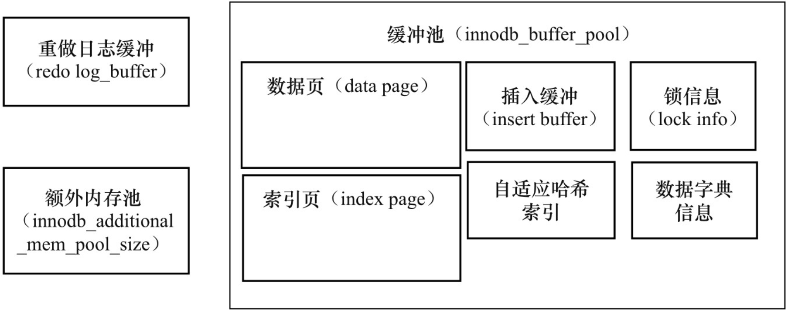

对于数据库中页的修改操作，则首先修改在缓冲池中的页，然后再以一定的频率刷新到磁盘上。页从缓冲池刷新回磁盘的操作并不是在每次页发生更新时触发

通过show engine innodb status;可以查看内存状态

==== 通过LRU List、Free List、Flush List管理缓冲池

* Free List: Free List中是可用的空闲页

* LRU Lists: 在InnoDB存储引擎中，缓冲池中页的大小默认为16KB，使用LRU算法对缓冲池进行管理。稍有不同的是InnoDB存储引擎对传统的LRU算法做了一些优化。在InnoDB的存储引擎中，LRU列表中还加入了midpoint位置。新读取到的页，虽然是最新访问的页，但并不是直接放入到LRU列表的首部，而是放入到LRU列表的midpoint位置(默认新读取的页插入到LRU列表尾端的37%的位置 即old blocks)。这个算法在InnoDB存储引擎下称为midpoint insertion strategy

midpoint前半部分定义为new blocks，后半部分定义为old blocks

**midpoint防止热点数据被刷出缓存**

**被读到LRU List里，后半部分的数据，要等待一段时间（innodb_old_blocks_time default 1000ms）后，如果再被读取时候还在list中，才会被加入到前半部分**

==== redo log buffer

InnoDB存储引擎首先将重做日志信息先放入到redo log buffer，然后按一定频率将其刷新到重做日志文件

这三种情况会讲buffer刷到磁盘::
- Master Thread每一秒将重做日志缓冲刷新到重做日志文件
- 每个事务提交时会将重做日志缓冲刷新到重做日志文件
- 当重做日志缓冲池剩余空间小于1/2时，重做日志缓冲刷新到重做日志文件

==== 额外内存池

提供给缓冲池内部结构额外消耗使用的内存池

=== Checkpoint技术

Write Ahead Log::

- 当前事务数据库系统普遍都采用了Write Ahead Log策略，即当事务提交时，先写重做日志，再修改页。当由于发生宕机而导致数据丢失时，通过重做日志来完成数据的恢复。这也是事务ACID中D（Durability持久性）的要求。

**倘若每次一个页发生变化，就将新页的版本刷新到磁盘,IO开销很大，若热点数据集中在某几个页中，先写入缓存，然后定期把缓存刷入磁盘，就合并了一个页中的多次修改，减少了磁盘IO**

innoDB设有checkpoint，就是分时段把缓存中的脏页刷到磁盘，innoDB中有两种checkpoint**Sharp Checkpoint**和**Fuzzy Checkpoint**

Sharp Checkpoint将所有脏页全量刷新到磁盘，对数据库可用性影响很大，默认只在数据库关闭时候执行

Fuzzy Checkpoint将部分脏页增量刷新到磁盘，数据库运行时候都是进入Fuzzy CheckPoint

innoDB中有一下集中Fuzzy CheckPoint::
* Master Thread Checkpoint
** Master Thread中发生的Checkpoint，差不多以每秒或每十秒的速度从缓冲池的脏页列表中刷新一定比例的页回磁盘，异步非阻塞
* FLUSH_LRU_LIST Checkpoint
** InnoDB存储引擎需要保证LRU列表中需要有差不多100个空闲页可供使用，如果没有，那就要移除LRU List尾部的页，如果有脏页，就需要进入checkpoint刷脏页。Page Cleaner中执行，异步非阻塞
* Async/Sync Flush Checkpoint
** 重做日志文件不可用的情况，这时需要强制将一些页刷新回磁盘，而此时脏页是从脏页列表中选取的，Page Cleaner Thread，异步非阻塞
* Dirty Page too much Checkpoint
** 脏页太多时进入checkpiont，默认脏页数据超过75%时进入

=== Master Thread

1.0的伪代码

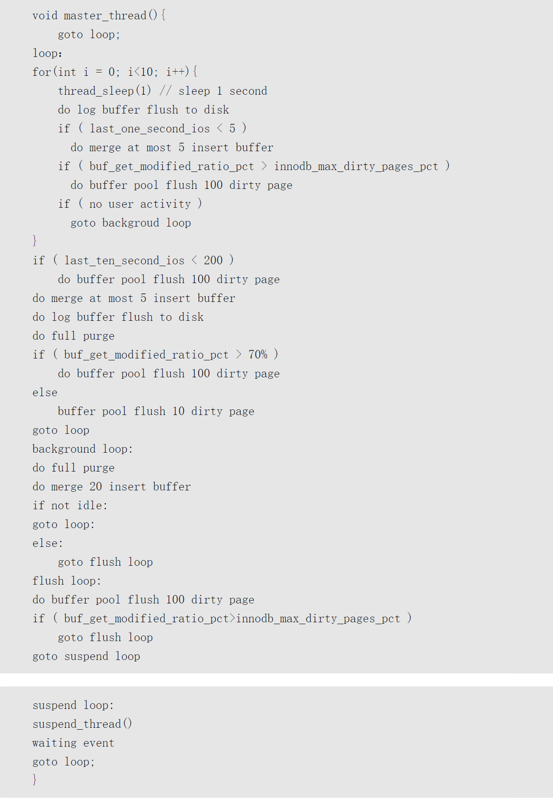

1.1的伪代码

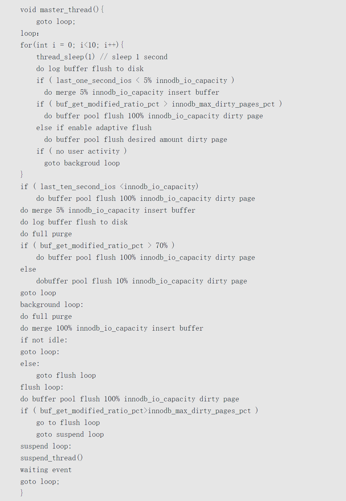

=== InnoDB特性

==== insert buffer（delete buffer、update buffer 同理，统称change buffer）

对于**非聚集索引**的插入或更新操作，不是每一次直接插入到索引页中，而是先判断插入的非聚集索引页是否在缓冲池中，若在，则直接插入；若不在，则先放入到一个Insert Buffer对象中。然后再以一定的频率和情况进行Insert Buffer和辅助索引页子节点的merge（合并）操作，这时通常能将多个插入合并到一个操作中（因为在一个索引页中），这就大大提高了对于非聚集索引插入的性能。（和G1中hot card是一个思路）

== mysql中的文件

=== 日志文件

* 错误日志
** 记录mysql运行的错误信息，默认启动
* 慢查询日志
** 记录慢查询，默认不启动
* 查询日志
** 记录所有对mysql的请求信息
* 二进制日志（bin log）
** 记录对mysql**执行更改**的所有操作，默认不启动，对mysql性能影响不大

**bin log**的主要作用::

- 恢复数据
- 复制数据，实现主从，master->slave、master->slave->slave 多级主从
- 检查是否有注入攻击

bin_log_format设bin log的格式，有3种格式

* statement
** 记录的sql语句，会导致主从机器上的rand、uuid函数结果不同
* row
** 记录的表行的变更情况，避免随机的问题，但会导致日志文件变大很多
* mixed
** mysql自行选择格式，大多数时候用statement，小部分情况用row

=== 表结构定义文件

无论什么存储引擎，MySQL对于每一个表，都有一个后缀为frm的文件，记录该表的表结构定义

=== InnoDB存储引擎中的文件

==== 表空间（tablespace）文件

默认有一个名为ibdata1的文件，是默认表空间文件。默认所有的表数据都存储在这个文件里。

可以通过innodb_file_per_table=on设置为每一个表创建一个单独的文件（tablename.ibd）用于存储该表的数据

单独的表空间文件只存储该表的数据、索引、插入缓冲的bitmap等信息，其余信息还在默认表空间（共享表空间）中

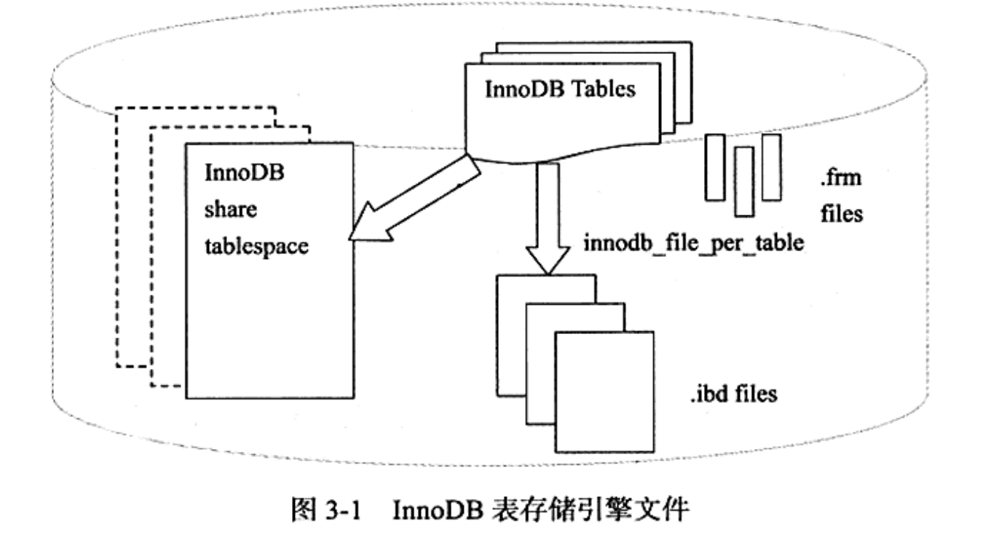

==== 重做日志（redo log）文件

记录innoDB存储引擎的事务日志，用于数据库恢复时候恢复数据

== 表

=== InnoDB逻辑存储结构

所有数据都被存放在表空间中，表空间由段、区、页组成。页也被称为块。

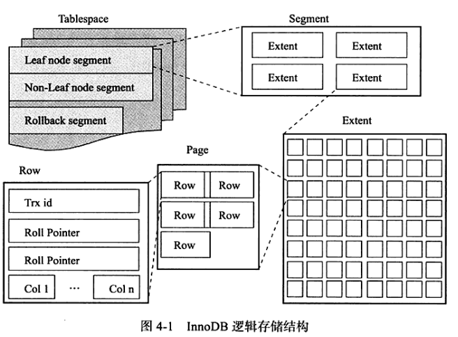

=== InnoDB行记录格式

==== Compact行记录格式

[width="100%",options="header,footer"]
|====================
| 变长字段长度列表 | null标志位 | 记录头信息 | 事务id | 回滚指针 | 列1数据 | 列2数据 | ...... 
|====================

* 变长字段长度列表
** 记录每个变长字段的长度，长度小于255字节用1个字节表示，长度大于255用两个字节表示

* null标志位
** 记录null列的位置，把数据为空的列对应的二进制位置标为1

* 记录头

image::resource\compact_header.png[compact记录头信息]

* 事务id与回滚指针

== InnoDB数据页结构

https://dev.mysql.com/doc/internals/en/innodb-page-overview.html[mysql文档中关于页结构的描述]

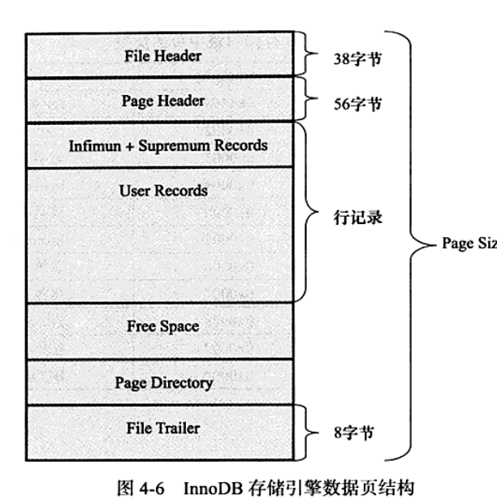

=== Infimum和Supremum Record

页中的虚拟行记录，用来界定记录边界，Infimum是下界，它的主键比页中所有主键都小，Supremum是上界，它的主键比页中所有主键都大，这两个界限值都是在页创建时候被建立

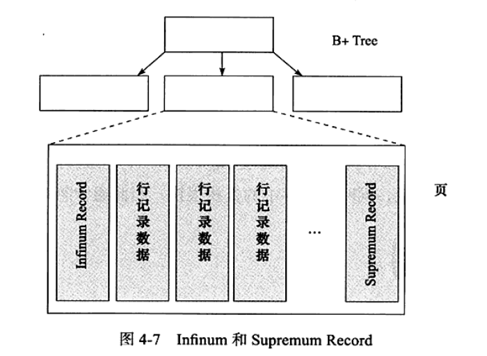

=== User Record和Free Space

User Record存储行记录

Free Space，空闲链表，在一条记录被删除后会被加入Free Space

=== page directory

一个稀疏目录，存储指向页中record的指针，这些指针称为slot，用于快速查找页中的record。每个slot追踪了6个record，slot中按照主键的逻辑顺序去追踪record。由于slot是按主键排序，并且固定尺寸的，所以在页中很容易通过二分查找查找数据。

由于页中使用的是稀疏目录，所以在slot间进行二分查找只能得到一个粗略的位置，即slot中主键序最小的数据（二分查找最终查找到一个slot，slot中最多有6条数据）。之后InnoDB会利用record header中的n_owned属性确定当前slot的实际size，之后按数量遍历。

=== file trailer

用来校验页的完整性

== InnoDB中查找一个数据行的全过程

. 通过二级索引，在b-tree中找到目标记录的主键id
. 通过聚簇索引在b-tree中找到主键id所在的数据页
. 若数据页不在缓冲池中，加载到缓冲池
. 在数据页通过二分查找在slots中找到目标数据所在的slot
. 通过slot中第一条数据的n_owned数据确定当前slot的实际size，之后遍历，找到目标数据行

== 分区

=== 一个使用分区导致查询性能大幅下降的例子

假设表有1000w数据，对主键做10个hash的分区，每个表约有100w数据。

此时执行select * from table where pk = @pk

通过主键查询可以只在一个分区中查找数据，确实速度更快了

但是由于b-tree结构的树高不高，可能100w数据和1000w数据的b-tree高度都是2，那实际io次数都是2，并不会变快。

如果1000w数据的b-tree高度为3，那确实减少1次io，提高速度

如果执行select * form table where key = @key

这是分区表需要扫描所有的10个分区，假设每个分区2次io，也需要20次io，而单表只需要2-3次io

== 索引

=== B+树
所有记录节点按照键值大小顺序存放在叶子节点上，相邻叶子节点通过指针相连。

.扇出为5的B+树图示
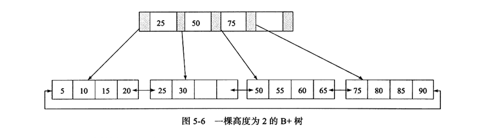

==== B+树插入

插入时候可能需要调整树结构，有3种情况

例：

*向5-6中插入键为28的节点*

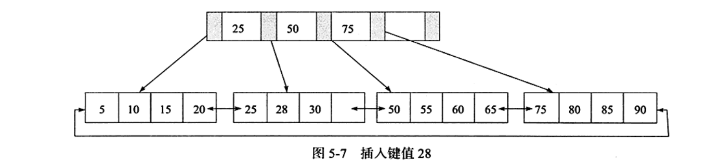

匹配情况1，叶子页和索引页都没满，直接插入

*向5-7中插入键为70的节点*

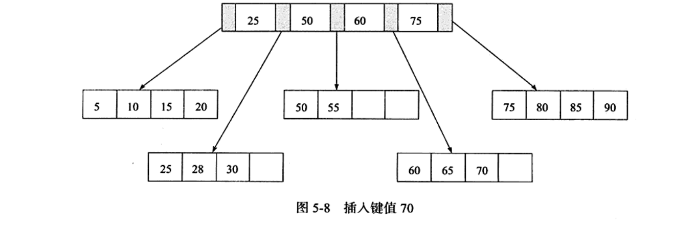

匹配情况2，叶子页满，索引页没满，拆分叶子页，找到中间的节点60，放到索引页，小于中间节点的记录放左边，大于等于中间节点的记录放右边

*向5-8中插入键为95的节点*

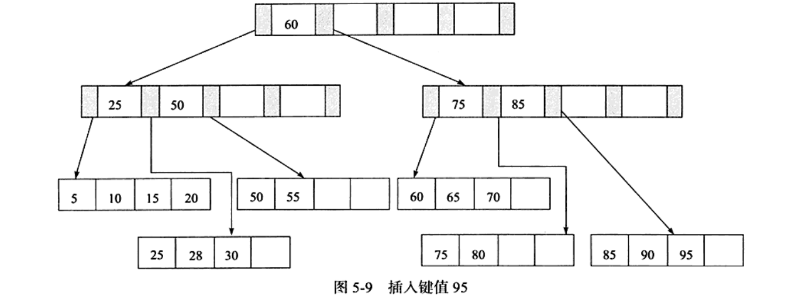

匹配情况3：叶子页满，索引页也满，先插入叶子页，叶子页满，拆分叶子页，找到中间节点85，小于中间节点的记录放左边，大于等于中间节点的记录放右边，中间节点85放到索引页，此时索引页满，拆分索引页，小于中间节点的记录放左边，大于中间节点的记录放右边，中间节点放入上一层的索引页

*B+树旋转*

插入时候可能产生大量的页分裂，导致大量IO，B+树通过旋转来减少页分裂

当叶子页满，但该页的左右兄弟页没满的时候，B+树不会拆分页，而是将记录移动到兄弟页上。通常左兄弟页会被首先检查用来做旋转操作

*向5-7中插入键为70的节点-旋转*

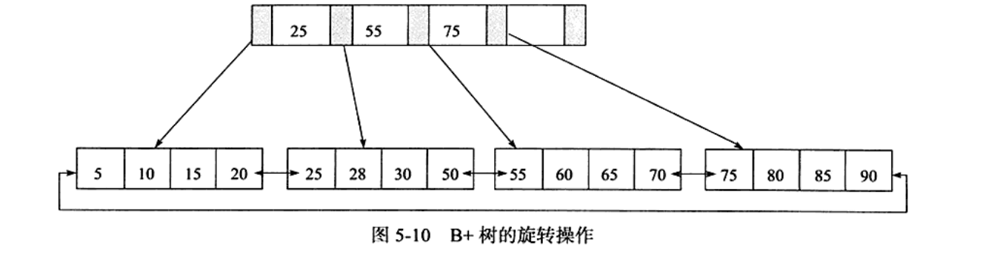

叶子页满，左兄弟页没满，最左节点移动到左兄弟，替换索引节点中的值为新的最左节点，向叶子页中添加值为70的节点

==== B+树删除

B+树使用填充因子控制树的删除变化，假设填充因子为50%，意味着在页中节点被删除后，如果页中节点数 / 扇出 < 50%，就会进行页的合并

B+树删除有3种情况：

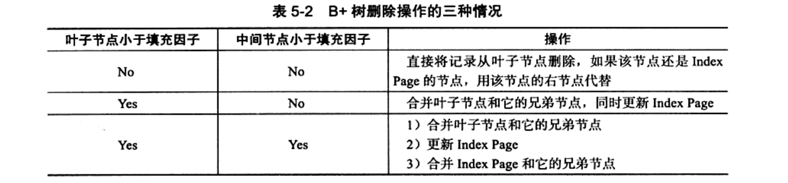

*删除5-9中值为70的节点*

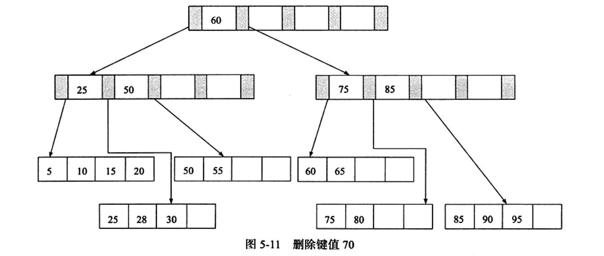

匹配情况1：删除后，叶子页的节点数 / 扇出 !< 50%，直接删除

*删除5-11中值为25的节点*

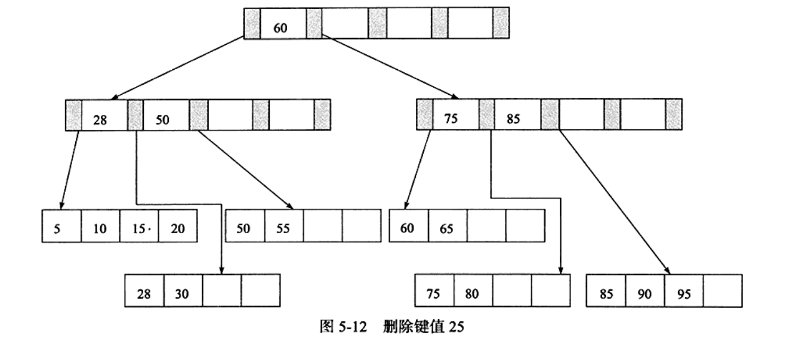

匹配情况1：删除后，叶子页的节点数 / 扇出 !< 50%，直接删除，同时25为索引页节点，25右边的节点28替换索引页中节点

*删除5-12中值为60的节点*

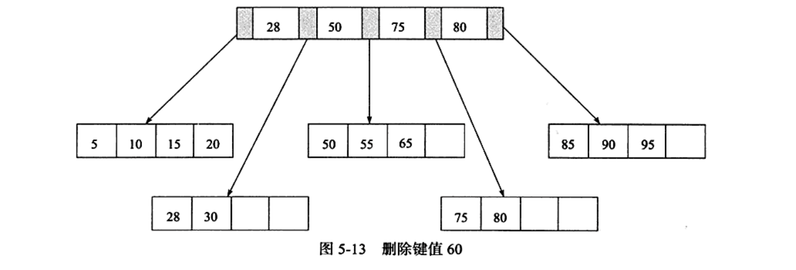

匹配情况3：删除后，更新索引页中值为60的节点为65，叶子页的节点数 / 扇出 < 50%，合并该节点和左兄弟节点，同时合并索引页60节点的左右孩子

=== B+树索引

==== 聚簇索引

[source,sql]
----
create table t (
    a int not null,
    b varchar(8000),
    c int not null,
    primary key(a),
    key idx_c(c)
) engine=innodb

insert into t select 1, repeat('a', 7000), -1;
insert into t select 2, repeat('a', 7000), -2;
insert into t select 3, repeat('a', 7000), -3;
insert into t select 4, repeat('a', 7000), -4;
----

B+树聚簇索引存储逻辑图

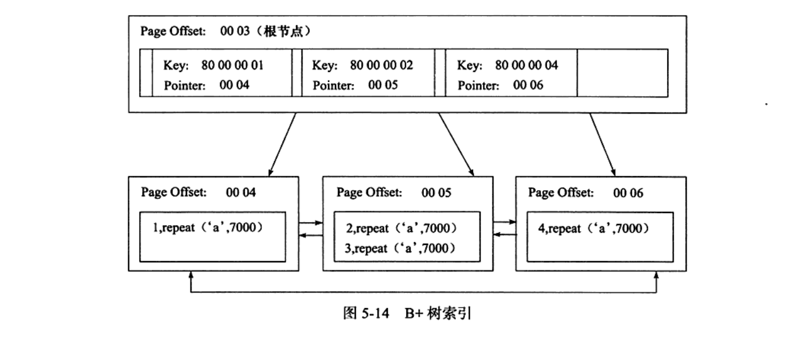

==== 辅助索引

叶子节点除了包含键，还包含一个bookmark，指向到哪里可以找到数据，innoDB中bookmark就是聚簇索引的键

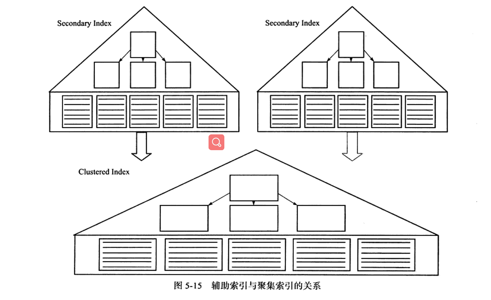

辅助索引存储逻辑图

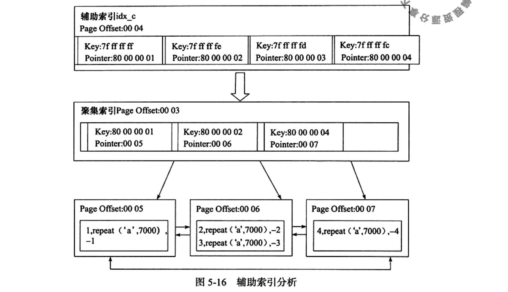

其中7fffffff为-1，80000001为1

==== B+树索引分裂

在InnoDB中，B+中插入数据并不总是从页中间分裂，这可能导致频繁的分裂

InnoDB基于数据库场景，对B+树插入做了一些改进

. 若插入是随机的，则取页中间记录作为分裂点

. 若往统一方向进行插入的记录数量 >= 5，且目前已定位到的记录之后存在 >= 3条记录，则分裂点为定位到的记录后的第三条记录

. 若往统一方向进行插入的记录数量 >= 5，且目前已定位到的记录之后存在 < 3条记录，则分裂点为待插入记录

匹配条件2的分裂

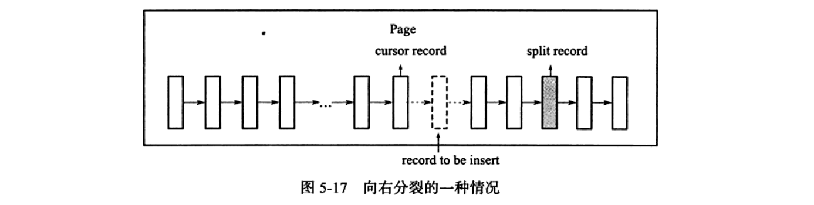

匹配条件3的分裂

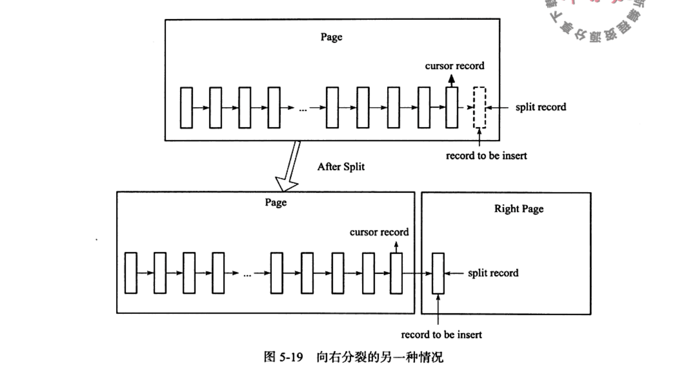

==== 覆盖索引

从辅助索引可以查到需要的记录，不需要到聚簇索引进行第二次查询

还可以通过覆盖索引优化统计查询 例如count(*)，因为辅助索引比聚簇索引小很多，可以减小io

=== Multi-Range Read(MRR)

把通过辅助索引查出来的主键进行排序后，再回表，将随机io转化为顺序io，提升io性能

MRR带来的好处

. 回表时候对主键排序，随机io变为顺序io
. 减少缓冲池中页被替换的次数
. 批处理主键回表的查询操作

=== Index Condition Pushdown(ICP)

在取出索引记录的时候根据索引上存储的信息过滤where条件中的范围条件

而不是从聚簇索引中读出记录后在根据where条件过滤

=== 倒排索引(inverted index)

两个表 一个表存储文档id和文档的文案内容，另一个表存储分词与文档id（也可以同时存储文档id和文档中该分词出现的位置）的关系

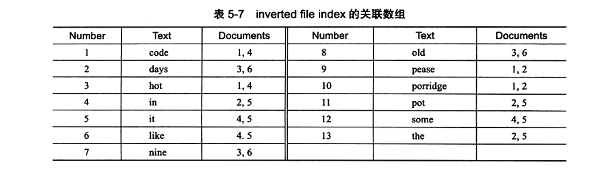

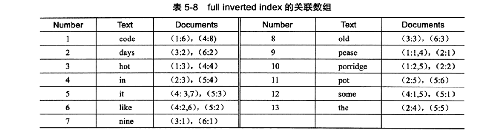

== explain

explain 按照mysql读取表数据的顺序依次为sql语句中的每一个表返回一条数据

mysql的联表：mysql从第一个表中读取一行，然后在第二个表中找到匹配的行，然后在第三个表中找到匹配的行，以此类推。当所有的表被处理完后，MySQL输出所选的列，并通过表列表回溯，直到找到一个有更多匹配行的表。从该表中读取下一行，然后继续处理下一个表。（深度优先遍历）

=== explain的输出

**id** 

id

**select_type** 

查询类型，主要的几种类型：

* **simple**:简单查询，不含子查询和联合查询
* **primary**:嵌套查询和联合查询中的最外层查询

**table**

表名

**partitions**

分区

**type**

join type，表示表是如何连接的，**在联表查询的时候很关键**

* **system**

查只有一行数据的系统表的查询，当常量连接

* **const**

最多只能读取到一行数据的查询，当常量连接

**只会发生在将 主键=常量 或 唯一键=常量的时候**
xx字段=常量的时候，可能也只读取一行数据，但是不满足最多只能读取**一行**数据

* **eq_ref**

在链表时候，深度优先遍历时，对于前面表中的每个行组合，只从该表中读取**一行**。
当连接使用索引的所有部分，并且索引是主键或UNIQUE NOT NULL索引时使用。

* **ref**

对于前面表中的每个行组合，将从该表中读取具有匹配索引值的**所有行**

* **fulltest**

使用全文索引做连接

和ref类似，但是同时也判断是否为空

* **index_merge**

使用了index_merge，使用一张表上的多个索引查询数据，之后合并。

* **unique_subquery**

* **index_subquery**

* **range**

只检索给定范围内的行，使用索引选择行

* **index**

使用索引扫描

* **all**

对前面表中的每个行组合进行全表扫描

**possible_key**

mysql可能选择的索引

**key**

mysql实际决定使用的索引

**key_len**

mysql实际决定使用的索引的长度，通过key_len可以确定 在一个联合索引中，mysql实际使用了左前缀的那些部分

**ref**
ref表示了某些列（列名）、常量集合（使用> 或< 等，展示数量）、某个常量（展示const）用来和索引进行比较

**rows**
执行查询时候需要扫描的行数，是个估计值

**filtered**
被条件过滤掉的数据百分比，是个估计值

**extra**
额外信息

* Using filesort
需要进行一次额外的排序

* Using index
可以从索引获取到全部数据，不需要根据主键回表（聚簇索引、覆盖索引）

* Using index condition
使用Index Condition Pushdown

* Using MRR
使用Multi-Range Read

* Using temporary
mysql会创建临时表来保存结果，通常在查询中的group by 和 order by的字段不一样的时候会发生

* Using where
WHERE子句用于限制哪些行与下一个表匹配或发送给客户端。除非您特别想从表中获取或检查所有行，否则如果Extra值不是Using where且表连接类型为all或index，则查询中可能会出现问题。

