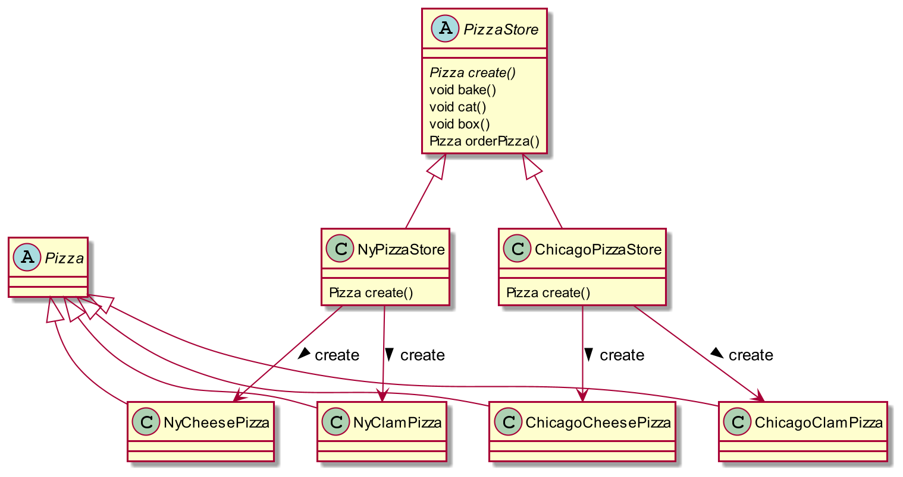
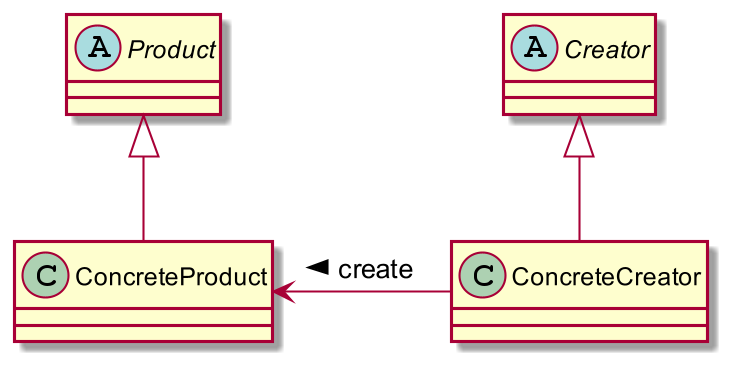
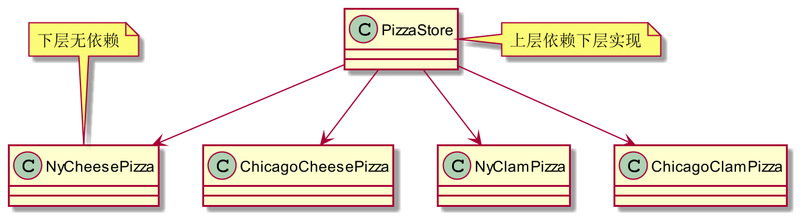
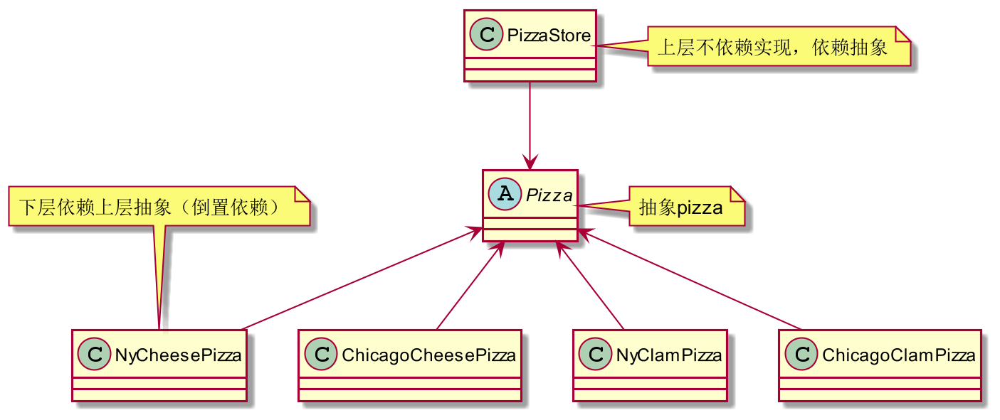
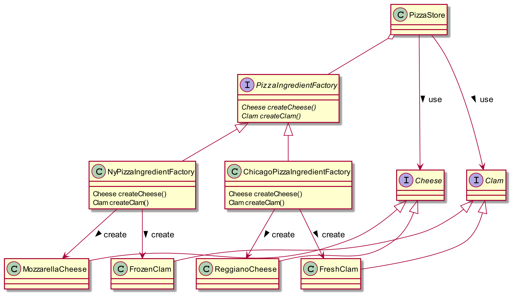
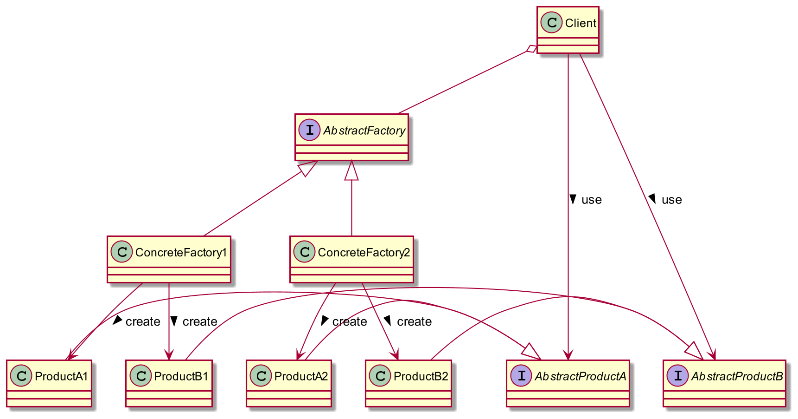

= 设计模式
:toc: left
:toclevels: 5
:toc-title: 目录

== 工厂模式

=== 工厂方法

**pizza工厂类图**

**工厂方法模式类图**

定义::
工厂方法模式定义了一个创建对象的接口，但由子类决定要实例化的类是哪一个。工厂方法让类吧实例化推车到子类。

**依赖倒置原则**

High level modules should not depend upon low level modules. Both should depend upon abstractions. Abstractions should not depend upon details. Details should depend upon abstractions

即依赖抽象不依赖具体类

=== 抽象工厂

定义::提供一个接口，用于创建相关或依赖对象的家族，而不需要明确指定具体类

抽象工厂通常通过**工厂方法**来实现具体的工厂

**pizza原料工厂类图**

**抽象工厂模式类图**

