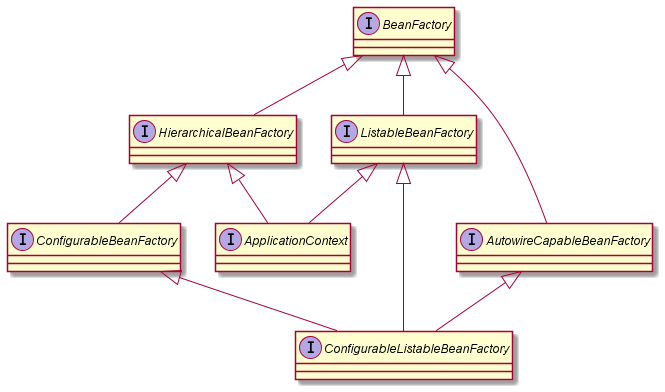
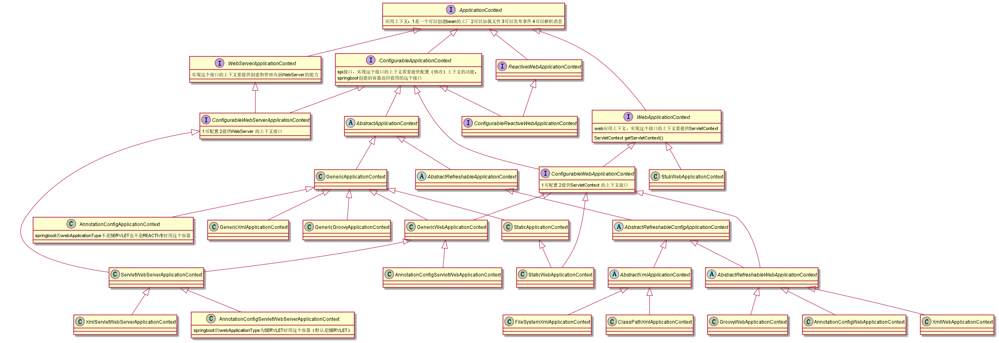

= spring
meguru <764904418@qq.com>
v1.0, 2020-10-25
:toc:
:toc-title: 目录
:toclevels: 5

== 如何自己实现一个@Autowired注解

. 扫描包，拿到Class[]
. 遍历Class[]，通过class.getDeclaredFields()拿到类字段field[]
. 遍历field[]，通过field.getAnnotation(AutoWired.class) != null过滤出有AutoWired注解的字段
. 通过field.getType().newInstance()(直接new不能保证单例了，sprring中会复杂些)创建需要注入的对象实例autoWiredInstance
. 通过field.set(parentClassInstance, autoWiredInstance)注入

== BeanFactory FactoryBean

FactoryBean 装饰器模式、工厂模式、代理

== PropertySource

[quote]
____
Abstract base class representing a source of name/value property pairs
____

spring中的KV抽象

EnumerablePropertySource::
枚举化的PropertySource

CommandLinePropertySource::
命令行PropertySource

SimpleCommandLinePropertySource::
参数类型是String的命令行

== spi

service provider interface，服务提供接口，接口实际归属于接口调用方，由接口调用方定义接口，接口实现方只负责实现

spring中的ConfigurableApplicationContext就是spi接口

== BeanFactory

*BeanFactory继承关系*

== ApplicationContext

*ApplicationContext继承关系*

